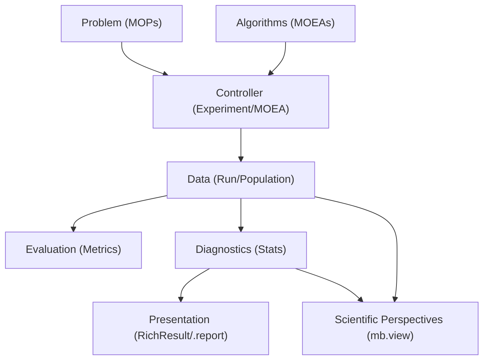

<!--
SPDX-FileCopyrightText: 2025 Monaco F. J. <monaco@usp.br>
SPDX-FileCopyrightText: 2025 Silva F. F. <fernandoferreira.silva42@usp.br>

SPDX-License-Identifier: GPL-3.0-or-later
-->

# MoeaBench Design Philosophy

MoeaBench is an **extensible analytical toolkit** that complements multi-objective optimization research by adding a layer of data interpretation and visualization over standard benchmark engines. It achieves this by organizing stochastic search data into a structured semantic model and transforming raw performance metrics into descriptive, narrative-driven results.

---

## 1. Documentation: Technical Storytelling (Scientific Narrative)

The most fundamental principle of MoeaBench is that code should be an instrument of insight. We believe that a researcher's tools should not only provide answers but also tell the story of the search process.

### Technical Storytelling
- **Narratives over Synopses**: We avoid dry bullet points. We prefer an elegant technical narrative that explains *why* a particular method was chosen or what a specific result implies for the search dynamics.
- **The "Scientific Journey"**: When documenting the codebase or design decisions, we value the narrative of evolution: "We initially attempted approach A, encountered trade-off B, and ultimately derived solution C."
- **Example-Driven Learning**: Every example in MoeaBench is a workshop. They follow a specific structure (Docstring Goal -> Implementation -> Interpretation) to ensure the user learns the "geology" of the problem as they run the code.

---

## 2. Infrastructure: The "Rich Result" System

All analytical tools in the `mb.stats` module must return standardized **Rich Result Objects**. These objects are designed to satisfy three goals: Predictability, Insight, and Performance.

### Architecture: `StatsResult`
All results inherit from a base `StatsResult` class. This ensures a consistent interface across the entire library.

### Narrative Reporting (`.report()`)
Every result object must implement a `.report()` method. This is the human-oriented face of the data. It should:
- Provide an analytical summary of the findings.
- Offer a diagnosis (e.g., "High Selection Pressure detected").
- Use elegant formatting (tables or narrative paragraphs).

### Lazy Evaluation
To maintain high performance without sacrificing detail, all secondary metrics (those not critical for the basic result) must be implemented using **Lazy Evaluation** (via Python's `@cached_property`). Computation is deferred until the user explicitly requests the data (e.g., calling `.report()` or accessing a specific property).

---

## 3. Visualization: The "fooplot" Convention

Visualization is a first-class citizen. A good plot is often the "Wow" moment that confirms a successful optimization.

### Scientific Domains Taxonomy
Direct plotting functions belong **exclusively** to the `mb.view` namespace and are organized into three domains: `topo_` (Topography), `perf_` (Performance), and `strat_` (Stratification).

> [!IMPORTANT]
> **Stability Policy**: 
> Starting with v0.7.0, we maintain a strict stability policy for the Alpha phase. While we introduce a refined Scientific Taxonomy, all legacy names and aliases are preserved to ensure that existing research scripts and notebooks remain functional while users transition to the new nomenclature.

### Aesthetic Excellence
- **Static by Default**: We prioritize readable, publication-quality static plots.
- **Curated Palettes**: We use harmonious, non-generic color palettes (often derived from HSL space) to represent different algorithms or population ranks.
- **Visual Intelligence**: Functions like `mb.view.spaceplot` are context-aware, automatically choosing 2D or 3D projections based on the problem dimensionality.

---

## 4. Performance: Mandatory Vectorization

MoeaBench aims for sustainable high performance on standard hardware.

### The "Loop-Free" Rule
We have a strict policy against iterating over population arrays using native Python loops. 
- All benchmarks, metric evaluators, and dominance sorters **must** be implemented using vectorized **NumPy** operations.
- This ensures that the framework scales efficiently even as population sizes and objective counts increase.

### Data Model: `SmartArray`
We use `SmartArray` as our primary data structure for objective matrices. It provides a labeled, structured way to handle results while maintaining the speed of raw NumPy arrays.

---

## 5. Architectural Integrity and Reproducibility

### Architecture Decision Records (ADRs)
We use ADRs to document the "DNA" of the project's evolution. Any significant design change (like the removal of parallelism or the implementation of Rich Results) must be recorded in [adr/](adr/). This ensures that the rationale behind our choices is never lost.

### Determinism by Design
Reproducibility is non-negotiable. The library maintains strict management of random seeds across single and multi-run experiments to ensure that every experiment can be reconstructed exactly.

### Mirror Parity
For every narrative script in [examples/](../examples/), there must be a corresponding Jupyter Notebook (`.ipynb`). This ensures that the library's features are accessible both as production-ready scripts and as interactive research environments.

---

## 6. Analytical Architecture

The MoeaBench architecture is designed as a pipeline that transforms raw evolutionary data into scientific insight. It follows a modular structure where decoupled components interact through a unified API.

### High-Level Architecture Flow

### The Component Layers

#### A. The Semantic Model (`core`)
The architecture begins with the Semantic Model, embodied by the `experiment`, `Run`, and `Population` classes. These entities represent the fundamental components of the scientific method, where an experiment serves as a container for multiple stochastic search attempts (runs), and each run tracks the detailed evolution of solution populations. Technically, these are object-oriented wrappers that manage state and metadata—such as random seeds and generation counters—while providing the semantic hooks that our analytical and visual tools use to interpret raw data.

#### B. The Vectorized Engine (`mops`, `metrics`, `stats`)
At the heart of the library lies the Vectorized Engine, a strictly procedural and stateless layer designed for extreme performance. This module encapsulates the mathematical theorems and performance measures of multi-objective optimization, transforming them into highly optimized NumPy operations. By avoiding native Python loops and operating directly on decision and objective matrices, the engine leverages low-level BLAS/LAPACK optimizations, ensuring that the library remains responsive even as complexity scales.

#### C. The Diagnostic Pipeline (`mb.stats`)
Building upon the vectorized engine, the Diagnostic Pipeline introduces the library's unique approach to data interpretation. When a researcher passes an experiment to a statistical function, such as `mb.stats.strata`, the pipeline initiates a transformation: it extracts the objective data and applies descriptive algorithms to generate a Rich Result Object. This process moves beyond raw numbers, offering an analytical diagnosis that explains the internal "geology" of the search, such as detecting unusual selection pressure or identifying mature dominance structures.

#### D. The Scientific View Layer (`view`)
The final stage of the pipeline is the Scientific View Layer, which translates abstract data into a spatial story. Functions like `mb.view.spaceplot`, `mb.view.rankplot`, `mb.view.casteplot`, and `mb.view.tierplot` are polymorphic by design, allowing them to accept various core objects (Experiments, Runs) or pre-calculated Rich Results. This layer ensures that the mathematical truth discovered by the stats module is rendered with aesthetic excellence and narrative clarity.

### Why this matters
By integrating these layers, MoeaBench ensures that logic, state, and visualization remain decoupled and consistent. This allows researchers to extend the framework—by adding new metrics or visualizers—without disrupting the existing analytical flow, maintaining a system that is both technically robust and analytically elegant.
