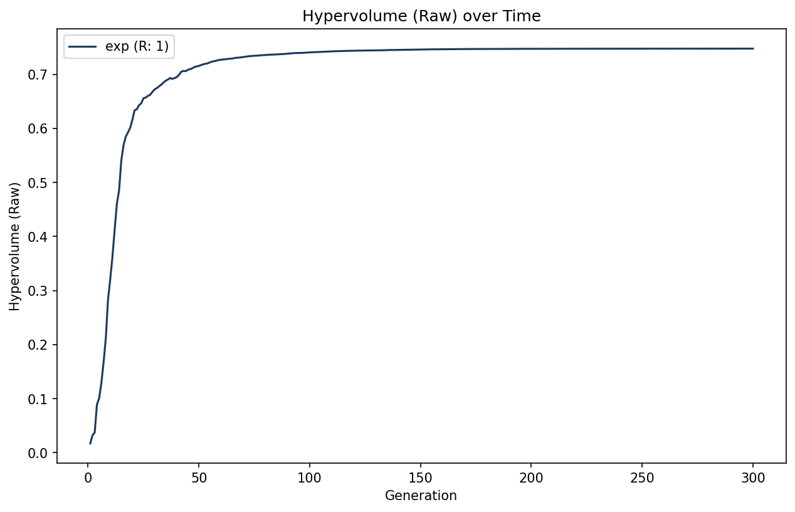
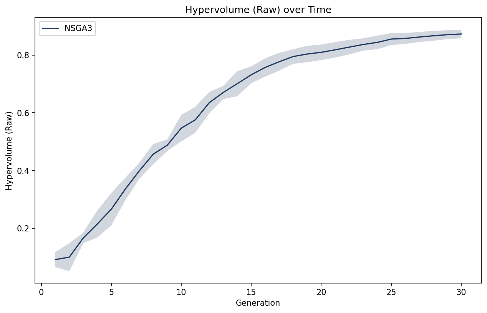
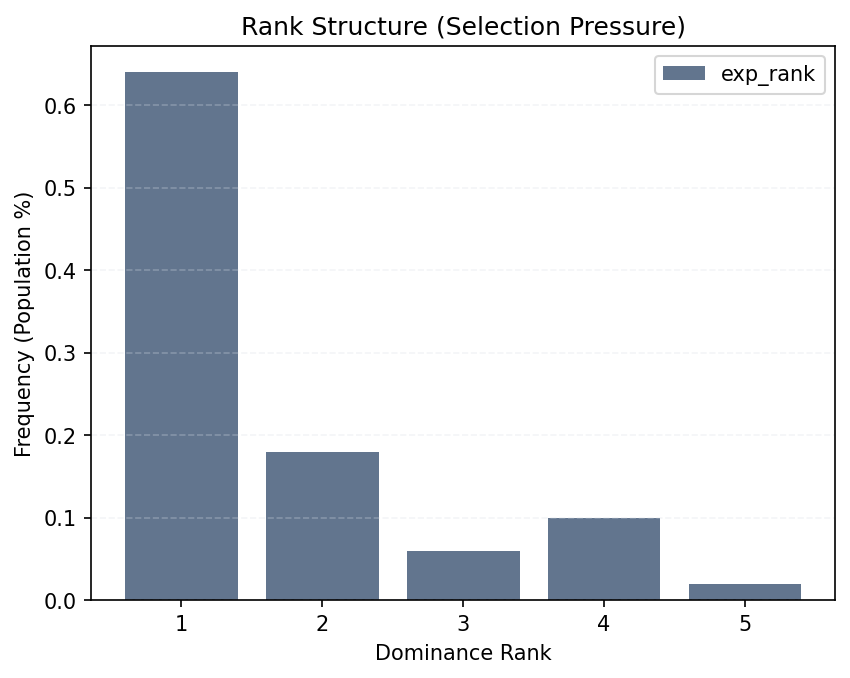
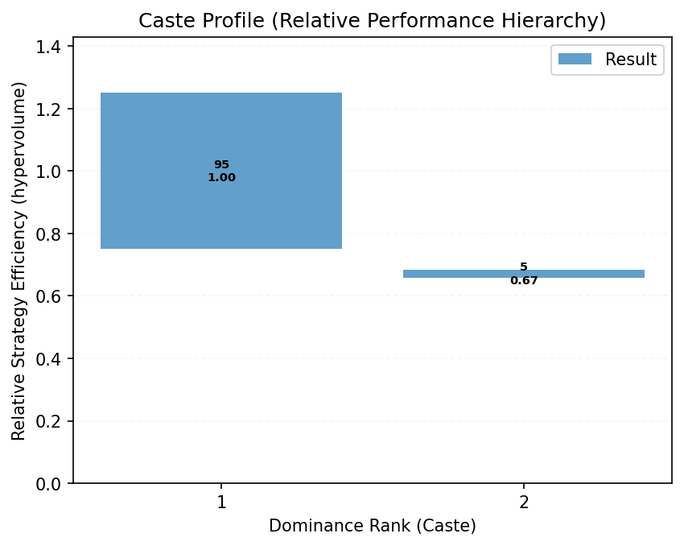
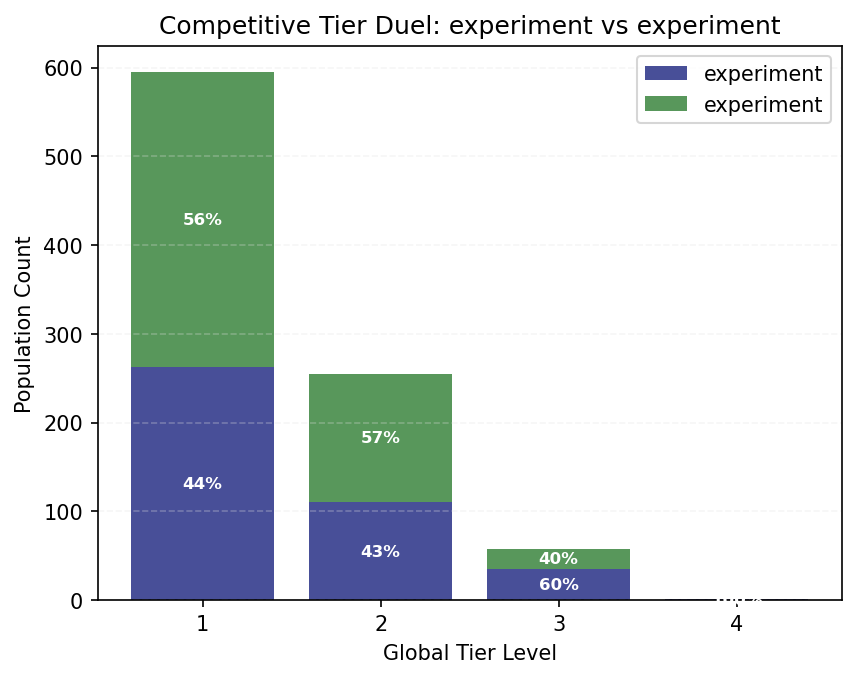

<!--
SPDX-FileCopyrightText: 2025 Monaco F. J. <monaco@usp.br>
SPDX-FileCopyrightText: 2025 Silva F. F. <fernandoferreira.silva42@usp.br>

SPDX-License-Identifier: GPL-3.0-or-later
-->

# MoeaBench User Guide

**Welcome to MoeaBench!**

MoeaBench is an **extensible analytical toolkit** designed to host and evaluate multi-objective optimization algorithms. Rather than just a library of pre-built solvers, its central philosophy is to serve as a **scientific laboratory** where users can "plug in" their own MOEAs and MOPs. 

By providing a decoupled architecture, MoeaBench allows you to treat your own algorithm as a modular plugin, benefiting from all built-in metrics, statistical tests, and visualizations without modifying the core framework.

The framework achieves this by organizing stochastic search data into a **structured semantic model**, transforming raw numerical trajectories into **intuitive programmatic access**, narrative-driven results, and professional visualizations.

MoeaBench's analytical integrity is anchored in the native, high-performance implementations of foundational benchmarks

*   **[DTLZ]** K. Deb et al. "[Scalable multi-objective optimization test problems](https://doi.org/10.1109/CEC.2002.1007032)." (2002).
*   **[DPF]** L. Zhen et al. "[Multiobjective test problems with degenerate Pareto fronts](https://doi.org/10.48550/arXiv.1806.02706)." (2018).

For mathematical implementation details, see the **[MOPs Guide](mops.md)**

This guide provides a pedagogical journey through the framework. For exhaustive technical specifications of every method and class, please consult the **[API Reference](reference.md)**.


---

## **1. Introduction: The Laboratory Philosophy**

MoeaBench operates on a **Plugin Architecture**. Its purpose is to provide the infrastructure—metrics, statistics, and plots—so you can focus on the core logic of your algorithm.

### **Key Features**
*   **Central Extensibility**: Seamlessly plug in custom problems or algorithms. Your code is the guest, MoeaBench is the host—zero modifications to the core library required.
*   **Many-Objective Support**: Optimized for high-dimensional objective spaces with no artificial numerical traps on $M$ or $N$.
*   **Hybrid Evaluation**: Intelligent metrics that automatically utilize exact methods for standard problems and efficient fallbacks (like Monte Carlo) for many-objective scenarios.
*   **Semantic Data Model**: A strict hierarchy (Experiment → Run → Population) that makes data access surgically precise.
*   **High-Level Delegation**: Powerful shortcuts that bridge the gap between structural data and scientific results.
*   **Polymorphic Visualization**: Plotting tools that "understand" the complex objects you pass to them.
*   **Statistical Rigor**: Built-in support for multi-run aggregation and standard non-parametric tests.


---

## **2. Quick Start: The "Hello World" Path**

The smallest meaningful unit in MoeaBench is the **Experiment**. An experiment establishes the link between a problem (MOP) and an algorithm (MOEA).

### **Hello MoeaBench!**
Let's solve the DTLZ2 benchmark (3 objectives) using the NSGA-III algorithm:

```python
import MoeaBench as mb

# 1. Setup laboratory
exp = mb.experiment()
exp.mop = mb.mops.DTLZ2(M=3) # Standard 3-objective problem
exp.moea = mb.moeas.NSGA3()

# 2. Start search process
exp.run()

# 3. View instant reward
mb.view.topo_shape(exp)     
mb.view.perf_history(exp)   
```

| Pareto Front (3D) | Convergence History |
| :---: | :---: |
|  |  |
| *Spatial Perspective: Final Population* | *Temporal Perspective: Hypervolume Evolution* |

*Note: In this example, `mb.view.topo_shape(exp)` automatically identifies and projects the **final population snapshot** (the state of the search at the last generation).*

---

## **3. Scientific Rigor: Multi-Run Experiments**

In evolutionary optimization, a single run is rarely representative. Stochastic algorithms require multiple independent trials to provide statistically significant conclusions.

### **Repeated Executions**
To execute multiple trials (repeating the experiment with different seeds), use the `repeat` argument:

```python
# Execute 10 independent trials
exp.run(repeat=10)
```

### **Cloud Aggregation**
When handling multiple runs, MoeaBench performs **Cloud Aggregation**. This means that high-level analysis tools automatically process the statistical distribution of all runs collectively.

For instance, visualizing a multi-run experiment showing the mean performance and variance:
```python
mb.view.perf_history(exp)
```

| Convergence History |
| :---: |
|  |
| *Temporal Perspective: Mean Hypervolume with Variance Cloud* |

To plot a specific stochastic trajectory (e.g., the 5th run) instead of the aggregate cloud, simply index the experiment:
```python
mb.view.perf_history(exp[4])
```

For finer control over specific runs or access to individual trajectories, see **[Section 4: The Data Hierarchy](#4-mastery-the-data-hierarchy)**.

### **Control: Custom Stop Criteria**

MoeaBench allows you to inject custom logic to halt the search process based on dynamic conditions (e.g., convergence, time limits, or specific targets). This can be set globally for the experiment or per execution.

The stop function receives the **Algorithm Instance** as its context, allowing access to the current generation (`algo.n_gen`), population (`algo.pop`), and problem (`algo.problem`).

```python
# 1. Define a global criteria (applies to all future runs)
# Stop if we reach generation 50 (ignoring the default max)
exp.stop = lambda algo: algo.n_gen >= 50
exp.run()

# 2. Override for a specific run (e.g., debug mode)
# Check if the first objective of the best solution is negative
exp.run(stop=lambda algo: algo.pop.best_obj[0] < 0.0)

# 3. Disable custom criteria (revert to standard generations)
exp.stop = None
```

---


## **4. Mastery: The Data Hierarchy**

MoeaBench organizes data in a strict hierarchy that mirrors the structure of a scientific study. Understanding this architecture allows for surgical precision in data extraction.

### **The Canonical Selector**
Data access is a journey from the "Manager" down to the raw numbers:

```text
  LAYER:     Experiment  -->     Run     -->     Filter    -->     Space
  OBJECT:      [exp]     -->    [run]    -->    [.pop()]   -->  [.objectives]
  ROLE:      Manager         Trajectory      Snapshot           Numbers
```

Using standard indexing and methods, you can navigate these layers:

*   **Layer 1: Experiment (`exp`)**: The root container holding all executions.
*   **Layer 2: Run (`exp[i]`)**: A specific stochastic trajectory identified by its seed.
*   **Layer 3: Population (`exp.pop(n)`)**: A snapshot of the search at a generation `n`.
*   **Layer 4: Data Space (`exp.pop(n).objs` or `.vars`)**: The raw numerical performance matrix (NumPy arrays).

#### **Single-run access Example**
MoeaBench uses **1-based** indexing for generations in `.pop()`, while `0` refers to the initial population and `-1` refers to the final generation.

```python
# A. Get objectives at generation 100 of the first trial
objs_100 = exp[0].pop(100).objectives

# B. Get final decision variables (explicit index -1)
vars_final = exp[0].pop(-1).variables

# C. Deep extraction: ND variables from final gen of the third run
# [Run 2] -> [Last Pop] -> [ND Filter] -> [Space]
nd_vars = exp[2].pop().non_dominated().variables
```

---

## **5. Solution Filters**

Instead of manual array slicing, MoeaBench provides **Solution Filters** (Semantic Operators). These filters adjust their scope automatically: when called from an **`Experiment`**, they aggregate results from all runs; when called from a **`Run`**, they target that specific trajectory.

```python
# --- Manager Context (Aggregation Cloud) ---
nd   = exp.non_dominated()    # Elite among ALL runs (Superfront)
dom  = exp.dominated()        # Solutions surpassed by at least one in the cloud
ref  = exp.optimal()          # Analytical reference (Truth)

# --- Single-run access (Specific Trajectory) ---
nd_1 = exp[0].non_dominated() # Elite of the first run only
nd_n = exp.pop(50).non_dominated() # Elite of generation 50 across all runs

# --- Visualization (Extracting Space) ---
mb.view.topo_shape(nd.objs, ref.objs)
```

*Note: In the methods above, you can pass an optional generation index `n` (e.g., `exp.non_dominated(50)`); leave it empty to retrieve the **final** state by default.*

---

## **6. The Power of Delegation: Master Reference**

MoeaBench uses **Delegation** to provide intuitive shortcuts. The `Experiment` manager provides a global perspective by default, while individual `Run` objects provide surgical access.

| Command | Perspective | Technical Equivalent (Structural Access) |
| :--- | :--- | :--- |
| **`exp.last_run`** | The most recent trajectory. | `exp.runs[-1]` |
| **`exp.last_pop`** | Final population of the last run. | `exp.last_run.pop(-1)` |
| **`exp.front()`**  | **Superfront**: ND objectives across *all* runs. | `exp.pop().non_dominated().objs` |
| **`exp.set()`**    | **Superset**: ND variables across *all* runs. | `exp.pop().non_dominated().vars` |
| **`exp.non_front()`**| **Dominance Cloud**: Concatenated dominated objectives. | `exp.pop().dominated().objs` |
| **`exp.non_set()`**  | **Inverse Cloud**: Concatenated dominated variables. | `exp.pop().dominated().vars` |
| **`exp.objectives`**| Raw cloud objectives (all final runs combined). | `exp.pop().objs` |
| **`exp.variables`** | Raw cloud variables (all final runs combined).| `exp.pop().vars` |
| **`exp.optimal_front()`**| The True (Analytical) Pareto Front. | `exp.optimal().objs` |
| **`exp.optimal_set()`**  | The True (Analytical) Pareto Set. | `exp.optimal().vars` |

### **Single-run access**
To access the same metrics for a specific trial, simply navigate to the run level:
*   `exp.last_run.front()` $\to$ Front of the last run only.
*   `exp[i].non_dominated()` $\to$ Elite of the $i$-th run only.

### **Ergonomic Aliases (Layer 4)**
Regardless of the delegation level, you can always use short aliases to access the raw NumPy data:
*   **`.objs`** $\to$ `.objectives`
*   **`.vars`** $\to$ `.variables`

---

## **7. Scientific Perspectives: The Three Domains**

MoeaBench organizes all analytical tools into three fundamental scientific domains. This taxonomy helps you choose the right "lens" to observe your search process.

### **7.1 Topography (`topo_`)**
> **Focus: The Geography.** "Where are the solutions in the space of objectives?"

This domain treats the search outcomes as physical coordinates. It is used to analyze coverage, convergence, and spatial diversity.

*   **`topo_shape`**: Visualizes the geometry of the Pareto front or the entire population cloud in 2D or 3D.
*   **`topo_bands`**: Visualizes **Search Corridors**. It uses Empirical Attainment Functions (EAF) to show the reliability bands (e.g., the region reached by 50% or 90% of the runs).
*   **`topo_gap`**: Highlights the **Topologic Gap**. Identifies exactly which regions of the objective space one algorithm covers that the other does not.
*   **`topo_density`**: Employs Kernel Density Estimation (KDE) to show the spatial probability of solutions along each axis.

```python
# The "Research Standard" View
mb.view.topo_shape(exp.front(), exp.optimal_front())

# Analyzing Search Reliability (50% and 90% bands)
mb.view.topo_bands(exp, levels=[0.5, 0.9])
```

### **7.2 Performance (`perf_`)**
> **Focus: The Utility.** "How well did the algorithms perform according to scalar metrics?"

This domain reduces high-dimensional outcomes into scalar scores (Hypervolume, IGD) to build leaderboards and verify statistical significance.

*   **`perf_history`**: Plots the evolution of a metric over generations, showing the mean trajectory and variance cloud.
*   **`perf_spread`**: Visualizes **Performance Contrast**. It uses Boxplots to compare distributions and automatically annotates them with the **A12 Win Probability** and P-values.
*   **`perf_density`**: Shows the "Form of Luck"—the probability distribution of metric values, identifying if an algorithm is stable or outlier-prone.

#### **Metric Rigor and Interpretation**
MoeaBench prioritizes mathematical honesty. When evaluating performance against a **Ground Truth (GT)**, the following protocols apply:

*   **Tripartite Hypervolume Reporting**: Starting with v0.7.6, HV is no longer a single number. We report:
    1.  **HV Raw**: The physical dominated volume.
    2.  **HV Ratio**: Search area coverage (normalized to 1.1 reference).
    3.  **HV Rel**: Convergence to the truth.
*   **Performance Saturation (HV_rel > 100%)**: This occurs when an algorithm's population fills spatial gaps within the discrete reference sampling of the GT. It is a sign of **Convergence Saturation**—the algorithm has reached the maximum precision allowed by the reference discretization.
*   **The EMD Diagnostic**: Proximity metrics like IGD can be deceptive on degenerate fronts (e.g., DPF family). We use **Earth Mover's Distance (EMD)** as our primary indicator of **Topological Integrity**. A high EMD signal takes precedence over IGD, as it identifies clumping and loss of manifold extents that distance-based metrics might overlook.

```python
# Statistical contrast between two methods
mb.view.perf_spread(exp1, exp2, metric=mb.metrics.hv)

# Metric evolution over time
mb.view.perf_history(exp)
```

### **7.3 Stratification (`strat_`)**
> **Focus: The Geology.** "How is the population organized internally?"

Internal structure analysis looks "under the hood" of the Pareto front to understand selection pressure and dominance hierarchies.

*   **`strat_ranks`**: Shows the distribution of individuals across non-domination layers (Ranks).
*   **`strat_caste`**: Maps the relationship between quality and class membership, revealing how the elite differs from the rest of the population.
*   **`strat_tiers`**: A "Duel of Proportions" that merges two algorithms into global tiers to see who dominates whom in direct competition.

```python
# Competitive Tier Analysis
mb.view.strat_tiers(exp1, exp2)
```

---

## **8. Statistical and Structural Analysis (`mb.stats`)**

The `mb.stats` module is the analytical engine of MoeaBench. It transforms raw stochastic trajectories into structural insights and scientific evidence, operating with the same polymorphic intelligence as the visualization system.

### **8.1 Stratification and Dominance Analysis**

Stratification is the definitive process of organizing a population into discrete non-domination layers, or Pareto ranks. In MoeaBench, every structural analysis—whether it evaluates the selection pressure of a single solver or the competitive infiltration between two rivals—is rooted in the concept of stratification.

At the core of this analysis are the `strata` and `tier` functions. While `mb.stats.strata(data)` dissects the internal layers of a specific population context, the `mb.stats.tier(exp1, exp2)` function orchestrates a joint-stratification duel. By merging the state of two competitors and ranking them as a unified set, the framework establishes global tiers that reveal the relative dominance in the objective space.

#### **Accessing Structural Data**
The result of a stratification analysis is stored in a `StratificationResult` (or `TierResult` for competitive duels). These objects provide programmatic access to the following properties:

```python
# Perform the analysis
res = mb.stats.strata(exp)
```

The object `res` contains the following metrics and data structures:
*   **`.max_rank`**: The total number of non-domination layers found (search depth).
*   **`.frequencies()`**: A NumPy array representing the distribution percentage of the population across ranks.
*   **`.selection_pressure()`**: A numeric value (0 to 1) estimating the convergence focus based on rank decay.
*   **`.quality_by(metric)`**: A vector of quality values (e.g., IGD or Hypervolume) mapped to each dominance layer.
*   **`.dominance_ratio()`** *(Tier only)*: The relative proportion of each group in the first global rank (the elite).
*   **`.displacement_depth()`** *(Tier only)*: The specific rank index where the rival group begins to appear significantly.

#### **Visualizing the Dominance Hierarchy**
The structural plots are polymorphic lenses that visualize these results. Because stratification metrics typically evaluate the entire search state, they operate over the population cloud.

```python
# 1. Structural Analysis of a single experiment
res = mb.stats.strata(exp)
mb.view.strat_ranks(res)      
mb.view.strat_caste(res)  

# 2. Competitive Tier Analysis (Joint Strata)
res_tier = mb.stats.tier(exp1, exp2)
mb.view.strat_tiers(res_tier) # Joint dominance duel
```

| Dominance Distribution (`strat_ranks`) | Relative Efficiency (`strat_caste`) |
| :---: | :---: |
|  |  |

| Competitive Duel (`tierplot`) |
| :---: |
|  |

Beyond structural profiles, the laboratory requires rigorous evidence to determine if performance differences are statistically significant across independent trials. The `mb.stats` module provides a suite of stochastic inference tools designed to handle the non-parametric nature of multi-objective performance data.

The `mb.stats.perf_evidence(exp1, exp2)` function serves as the standard rank-sum test for differences in the center of location (median). In addition, the `mb.stats.perf_distribution(exp1, exp2)` implements the Kolmogorov-Smirnov test to identify disparities in the overall shape of the distributions, such as variance, stability, or bimodality. To quantify the magnitude of these differences, the `mb.stats.perf_probability(exp1, exp2)` function calculates the Vargha-Delaney effect size statistic.

#### **Accessing Inference Meta-data**
Hypothesis test functions return a `HypothesisTestResult` object that encapsulates the scientific findings:

```python
# Perform the inference test
res = mb.stats.perf_distribution(exp1, exp2)
# (equiv: mb.stats.perf_distribution(mb.hv(exp1.pop().objs), mb.hv(exp2.pop().objs)))
```

## **8. Advanced Analytics: Significance & Robustness**

MoeaBench provides a rich set of non-parametric statistical tools to transform execution data into scientific evidence. In this library, we distinguish between two fundamental types of inquiry:

1.  **Performance Analysis**: Evaluates "who is better" in terms of objective quality (HV, IGD).
2.  **Topologic Analysis**: Evaluates "what was found" in terms of spatial distribution and coverage.

### **8.1. Performance Analysis (`mb.stats.perf_*`)**

These tools operate on scalar performance metrics (usually from a multi-run experiment) to determine the merit and confidence of an algorithm's results.

#### **Statistical Significance (`mb.stats.perf_evidence`)**
This is the primary tool for hypothesis testing in experimental scenarios. It performs the **Mann-Whitney U** rank test (also known as the Wilcoxon rank-sum test) to answer: *"Is the observed difference in performance statistically significant, or could it be due to random variation?"* By focusing on the ranks of the data rather than mean values, it provides a robust measure against non-normal distributions common in evolutionary optimization.

```python
# Returns a HypothesisTestResult object
res = mb.stats.perf_evidence(exp1, exp2, metric=mb.metrics.hv)
print(res.report()) 

if res.p_value < 0.05:
    print(f"Confidence confirmed for {res.name}")
```

#### **Win Probability (`mb.stats.perf_probability`)**
While significance tells us if we can trust the results, it doesn't describe the "strength" of the superiority. The `perf_probability` tool calculates the **Vargha-Delaney $\hat{A}_{12}$** effect size. Mathematically, this captures the "Win Probability": the likelihood that a randomly selected execution of Algorithm A will outperform Algorithm B. This provides a pragmatic, human-readable indicator of practical superiority.

*   **A12 > 0.5**: Algorithm A is likely better.
*   **A12 = 0.5**: They are equivalent.
*   **A12 < 0.5**: Algorithm B is likely better.

```python
prob = mb.stats.perf_probability(exp1, exp2, metric=mb.metrics.hv)
print(f"Probability of Exp1 beating Exp2: {prob:.2f}")
```

#### **Distribution Shape (`mb.stats.perf_distribution`)**
Sometimes two algorithms have the same average performance but different "stability". The `perf_distribution` tool uses the **Kolmogorov-Smirnov (KS)** test to identify if the *shape* of the performance distributions is different (e.g., detecting if one algorithm is more prone to outliers).

```python
# Returns a HypothesisTestResult object
res = mb.stats.perf_distribution(exp1, exp2, metric=mb.metrics.hv)
print(res.report())
```

### **8.2. Topological Analysis (`mb.stats.topo_*`)**

These tools are designed to answer: *"Did these algorithms find the same thing?"* They perform multi-axial distribution matching to verify if the populations found by different solvers are statistically equivalent in their spatial distribution.

#### **Spatial Distribution Matching (`mb.stats.topo_distribution`)**
The `mb.stats.topo_distribution(*args)` function is designed for this topological inquiry. It operates as a multi-axial engine, verifying if the clouds of solutions found by different solvers are statistically equivalent in their spatial distribution across each dimension.

This tool is foundational for detecting **multimodality** (identifying if different search paths lead to different regions) or verifying the **consistency** of new algorithms against established benchmarks. Users can select the mathematical soul of this comparison through the `method` argument:

*   **`method='ks'` (Default)**: Employs the **Kolmogorov-Smirnov** test per axis. Ideal for detecting any kind of shift, scaling, or shape difference.
*   **`method='anderson'`**: Uses the **Anderson-Darling k-sample** test, which is more sensitive to differences in the tails of the distributions—critical for analyzing corner cases in Pareto fronts.
*   **`method='emd'`**: Calculates the **Earth Mover's Distance** (Wasserstein Metric), providing a purely geometric measure of how much "work" would be required to transform one cloud into the other.

#### **Performance vs. Topology**
It is scientifically possible for two algorithms to have identical Hypervolume (Performance Equivalence) but converge to completely different regions of the objective space (Topological Divergence). Conversely, they might find the same Pareto Front (**`exp.front()`**) but through different sets of decision variables (**`exp.set()`**). `topo_distribution` allows you to dissect these nuances by comparing distributions axis-by-axis across both spaces.

#### **Cascading Hierarchy in Matching**
Following the MoeaBench abstraction hierarchy, `topo_distribution` automatically resolves the data context based on the input:

```python
# 1. Level 1: Direct Array Matching
res_raw = mb.stats.topo_distribution(matrix_a, matrix_b)

# 2. Level 4: Explicit Snapshot Matching
res_front = mb.stats.topo_distribution(exp1.front(), exp2.front()) 
res_set   = mb.stats.topo_distribution(exp1.set(),   exp2.set())   

# 3. Level 5: The Experiment Manager (Total Abstraction)
res = mb.stats.topo_distribution(exp1, exp2) 
res_vars = mb.stats.topo_distribution(exp1, exp2, space='vars') 
```

#### **Analyzing the Match Result**
The function returns a `DistMatchResult` object that provides a dimensional breakdown of the convergence:
*   **`.is_consistent`**: A global boolean indicating if **all** tested axes (objectives or variables) are equivalent.
*   **`.failed_axes`**: A list of indices identifying exactly where the algorithms diverged.
*   **`.p_values`**: A dictionary providing the specific p-value for each dimension.
*   **`.report()`**: A quantitative analysis report that lists each axis and its match status.

```python
if not res.is_consistent:
    print(f"Divergence detected in dimensions: {res.failed_axes}")
```

#### **8.3.1. Visual Distribution Matching (`mb.view.topo_density`)**

Statistical reports are legally sufficient but often intuitively incomplete. MoeaBench provides the **Spatial Density Perspective** via `mb.view.topo_density()`. This employs **Kernel Density Estimation (KDE)** to generate smooth density curves, embedding the statistical verdict directly into the canvas.

Topologic analysis also includes the study of **attainment surfaces**—the boundaries in objective space that an algorithm can "reach" with a certain probability (e.g., the Median Attainment Surface). This logic is grounded in the theory of **Empirical Attainment Functions (EAF)**.

*   **`mb.stats.topo_attainment`**: Calculates the surface reached by $k\%$ of the runs using the **EAF** methodology.
*   **`mb.stats.topo_gap`**: Compares the EAFs of two experiments to identify where one algorithm has a coverage "gap" (regions it cannot reach that the competitor can), effectively mapping the **EAF Difference**.

```python
# Calculate median surface
surf = mb.stats.topo_attainment(exp1, level=0.5)

# Calculate spatial gap between algorithms
gap = mb.stats.topo_gap(exp1, exp2)
print(gap.report())
```

---

## **9. Extensibility: Plugging your Algorithm**

Extensibility is the core reason for MoeaBench's existence. You use the framework to evaluate **your** code.

### **Custom MOP Plugin**
To add a new problem, inherit from `mb.mops.BaseMop` and implement the `evaluation` method:

```python
class MyProblem(mb.mops.BaseMop):
    def __init__(self):
        super().__init__(M=2, N=10) # 2 objectives, 10 variables
        self.xl = np.zeros(10)      # Decision variable lower bounds
        self.xu = np.ones(10)       # Decision variable upper bounds

    def evaluation(self, X):
        # Must return a dictionary with the objectives matrix 'F'
        # Optional: include constraints matrix 'G'
        f1 = ...
        f2 = ...
        return {'F': np.column_stack([f1, f2])}
```

### **Custom MOEA Plugin**
To wrap your own algorithm, inherit from `mb.moeas.MOEA`. By implementing the `solve(mop)` interface, your algorithm gains access to all of MoeaBench's infrastructure, including multi-run management, persistence, and all plotting perspectives.

*For a step-by-step tutorial on building plugins, see the [Reference: Extensibility](reference.md#extensibility).*

---

## **10. Precision: Reproducibility & Seeds**

Scientific benchmarking requires absolute control over randomness. MoeaBench treats random seeds as fundamental metadata.

*   **Determinism**: You can set a base seed in the algorithm: `mb.moeas.NSGA3(seed=42)`.
*   **Multi-Run Sequence**: When running `repeat=N`, MoeaBench uses a deterministic increment sequence: `Run i` uses `base_seed + i`.
*   **Traceability**: Every `Run` object stores the exact seed used for its execution, ensuring any result can be perfectly replicated.

---

## **11. Persistence (`save` and `load`)**

MoeaBench allows you to persist experiments to disk as compressed ZIP files. This is essential for long-running studies, cross-tool analysis, and sharing experimental protocols. The persistence system supports selective modes to optimize file size and workflow:

```python
# 1. Save the complete state (Config + All Runs)
exp.save("full_study", mode="all")

# 2. Save only the 'Recipe' (No data)
exp.save("protocol", mode="config")

# 3. Load results into an existing setup
exp.load("results", mode="data")
```

#### **Persistence Modes**

*   **`all` (Default)**:
    *   **Behavior**: Persists the entire state, including the problem definition, algorithm configuration, and every execution trajectory (`runs`).
    *   **Utility**: Full project backups or archiving final research results for peer review and total reproducibility.
*   **`config`**:
    *   **Behavior**: Records only the "experimental protocol"—what problem was solved and with which algorithm settings—stripping away all gathered data.
    *   **Utility**: Sharing compact "recipes" of an experiment. On Loading, it updates your experiment's configuration (MOP/MOEA) while **preserving any existing runs**, allowing you to keep your current results while adopting a new protocol.
*   **`data`**:
    *   **Behavior**: Focuses on the results of the execution.
    *   **Utility**: Merging results from different machines or sessions. On Loading, it imports the **execution runs** from the file but **preserves your current configuration**, ensuring you don't overwrite your problem settings with those from the data file.

For details on the underlying file format (CSVs and joblib serialization), see **[Reference: Persistence](reference.md#persistence)**.

---

## **12. Data Export (CSV)**

While the persistence system (`save`/`load`) is designed for internal library state, you may often need to export raw numerical results for external analysis in tools like Excel, R, or Origin. 

MoeaBench provides a dedicated **Export API** in the `mb.system` module for this purpose. These methods automatically handle different types of input data (Experiments, Populations, or raw arrays) and generate formatted CSV files.

### **Exporting Objectives and Variables**

*   **`mb.system.export_objectives(data)`**: extracts the Pareto front from an experiment (or objectives from a population) and saves them as a CSV.
*   **`mb.system.export_variables(data)`**: extracts the Pareto set from an experiment (or decision variables from a population).

```python
# 1. Export results from a named experiment
exp.name = "my_study"
mb.system.export_objectives(exp) # Saves to "my_study_objectives.csv"

# 2. Export with a custom name
mb.system.export_variables(exp, "final_vars.csv")

# 3. Export data from a specific population snapshot
pop = exp.last_pop
mb.system.export_objectives(pop, "final_pop_objs.csv")
```

### **Features and Defaults**

*   **Intelligent Naming**: If no filename is provided, the system uses the `data.name` or `data.label` as a prefix. If neither is available, it defaults to `experiment`.
*   **Column Headers**: If `pandas` is installed, the CSV files will include headers like `f1, f2...` for objectives and `x1, x2...` for variables. If not, it falls back to a headerless NumPy format.

---

## **13. References**

*   **[API Reference](reference.md)**: Total technical mapping of the library.
*   **[Pymoo](https://pymoo.org)**: The optimization engine powering built-in algorithms.
*   **[MOPs Manual](mops.md)**: Detailed history and mathematics of built-in benchmarks.
