<!--
SPDX-FileCopyrightText: 2025 Monaco F. J. <monaco@usp.br>
SPDX-FileCopyrightText: 2025 Silva F. F. <fernandoferreira.silva42@usp.br>

SPDX-License-Identifier: GPL-3.0-or-later
-->

# MoeaBench User Guide

> **Version 0.10.2**

MoeaBench is an **extensible analytical toolkit** for Multi-objective Evolutionary Optimization research that adds a layer of data interpretation and visualization over standard benchmark engines. The framework establishes an intuitive abstraction layer for configuring and executing sophisticated quantitative analysis, transparently handling normalization, numerical reproducibility, and statistical validation. By transforming raw performance metrics into descriptive, narrative-driven results, it facilitates rigorous algorithmic auditing and promotes systematic, reproducible experimental comparisons.

To support this workflow, the package offers high-level facilities for programmatically establishing benchmark protocols and extracting standardized metrics. These features are augmented by advanced graphical capabilities that produce convergence time-series and interactive 3D Pareto front visualizations, bridging the gap between raw numerical data and actionable scientific insight.

For mathematical implementation of built-in MOPs and MOEAS, see the **[MOPs Guide](mops.md)**. To explore practical code usage, visit the **[examples/](file:///home/monaco/Work/moeabench/examples)** directory.

*   **[DTLZ]** K. Deb et al. "[Scalable multi-objective optimization test problems](https://doi.org/10.1109/CEC.2002.1007032)." (2002).
*   **[DPF]** L. Zhen et al. "[Multiobjective test problems with degenerate Pareto fronts](https://doi.org/10.48550/arXiv.1806.02706)." (2018).

This document provides an introductory guide through the framework. For detailed technical specifications of every method and class, please consult the **[API Reference](reference.md)**. For a certified snapshot of the library's performance, see the official **[Calibration Report](file:///home/monaco/Work/moeabench/tests/CALIBRATION.html)**.


---

## **1. Introduction: Design Philosophy**

MoeaBench operates on a **Plugin Architecture**. Its purpose is to provide the infrastructure—metrics, statistics, and plots—so you can focus on the core logic of your algorithm.

### **Key Features**
*   **Built-in Benchmark Suite**: Includes state-of-the-art implementations of foundational benchmarks (**DTLZ** and **DPF**), rigorously validated against the original literature and audited as the project's analytical "ground truth".
*   **Built-in Algorithms**: Provides built-in implementations of well-known, literature-referenced MOEAs (e.g., **NSGA-III**, **MOEA/D**, **SPEA2**).
*   **Plugin Architecture**: Seamlessly plug in your own algorithms (MOEAs) and problems (MOPs) without modifying the core library. The framework employs a host-guest plugin architecture where custom extensions integrate seamlessly with the core logic.
*   **Many-Objective Readiness**: Full support for Many-Objective Optimization (MaOO) with no artificial limits on the number of objectives ($M$) or variables ($N$).
*   **Performance & Scalability**: Built-in specialized evaluators that automatically switch between exact metrics and efficient approximations (e.g., Monte Carlo) to ensure computability of costly calculations as complexity increases.
*   **Rigor & Reproducibility**: Transparent handling of calibration and statistical validation to ensure robust and reproducible results.
*   **Interpretative Summaries**: Automatically generates interpretative summaries that complement numerical metrics with narrative insights.
*   **Rich Visualizations**: Produces rich spatial (3D fronts), temporal (convergence performance), and stratification (ranking) visualizations.

---

## **2. Getting Started: Minimal Working Example**

The smallest meaningful unit in MoeaBench is the **Experiment**. An experiment establishes the link between a problem (MOP) and an algorithm (MOEA).

### **Hello MoeaBench!**
Let's solve the DTLZ2 benchmark (3 objectives) using the NSGA-III algorithm:

```python
import MoeaBench as mb

# 1. Configure an experiment
exp = mb.experiment()                   # Instantiate an experiment
exp.mop = mb.mops.DTLZ2()               # Choose a benchmark problem
exp.moea = mb.moeas.NSGA3()             # Choose an optimization algorithm

# 2. Run the experiment
exp.run()

# 3. Visualization of Results
mb.view.topo_shape(exp)                 # View the resulting Pareto front  
mb.view.perf_history(exp)               # View the hypervomume convergence
```
The `view.perf_shape` function will produce a plot showing the topography of the resulting Pareto front.


*Figure 1: Spatial Perspective: Final Population snapshot projected in 3D.*

And the `view.perf_history` function will produce a plot showing the hypervolume convergence along generations.


*Figure 2: Temporal Perspective: Hypervolume evolution showcasing convergence.*

*   `exp.name = "NSGA3_on_DTLZ2"` $\to$ Names the experiment.
*   `exp.authors = "Monaco F. J."` $\to$ Assigns authorship for reproducibility.
*   `exp.license = "GPL-3.0-or-later"` $\to$ Assigns SPDX license (standardized IDs).
*   `exp.year = 2026` $\to$ Sets the publication year.
*   `exp.run()` $\to$ Orchestrates the actual optimization process.
*   `exp.save()` $\to$ Persists results to a ZIP with scientific metadata.
*Note: In this example, `mb.view.topo_shape(exp)` automatically identifies and projects the resulting Pareto front, i.e. the final population snapshot in the objective space. To project the Pareto set (decision space), or to inspect the intermediate solution at some point of the optimization process, please refer to **[Section 4: The Data Hierarchy: accessing results](#4-the-data-hierarchy-accessing-results)**. Likewise, `mb.view.perf_history(exp)` will plot the hypervolume convergence along all generations. To plot another performance metric (e.g. IGD) or to limit the number of generations to plot, please refer to **[Section 4: The Data Hierarchy: accessing results](#4-the-data-hierarchy-accessing-results)**.*

---

## **3. Statistical Rigor: Stochastic Experimentation**

In evolutionary optimization, a single run is rarely representative. Stochastic algorithms require multiple independent trials to provide statistically significant conclusions.

### **Repeated Executions**
To execute multiple trials (repeating the experiment with different seeds), you can specify the `repeat` argument directly in `run()`, or set the default `repeat` property:

```python
# Option A: Explicit argument
exp.run(repeat=10)

# Option B: Set default property
exp.repeat = 10
exp.run()
```

### **Reproducibility & Seeds**
Rigorous benchmarking necessitates distinct control over stochastic processes. MoeaBench treats random seeds as fundamental metadata to ensure experiments are perfectly replicable.

*   **Determinism**: You can set a base seed in the algorithm: `mb.moeas.NSGA3(seed=42)`.
*   **Multi-Run Sequence**: When running `repeat=N`, MoeaBench uses a deterministic increment sequence: `Run i` uses `base_seed + i`.

> [!TIP]
> **Global Defaults**: You can define default values for population, generations, seeds, and statistical thresholds globally using `mb.defaults`. This allows you to set a baseline for your entire project in a single place. See the **[API Reference](reference.md#defaults)** for the complete list of parameters.
*   **Traceability**: Every `Run` object stores the exact seed used for its execution.
*   **Automatic Seed Generation**: If you do not provide a seed, MoeaBench automatically generates a random one for you. This seed is then fixed and stored in the experiment metadata, ensuring that even "random" executions can be traced and reproduced later.

---

### **Cloud Aggregation**
When handling multiple runs, MoeaBench performs **Cloud Aggregation**. This means that high-level analysis tools automatically process the statistical distribution of all runs collectively.

For instance, visualizing a multi-run experiment showing the mean performance and variance:
```python
mb.view.perf_history(exp)
```


*Figure 3: Temporal Perspective: Mean Hypervolume trajectory with shaded Variance Cloud across multiple runs.*

To plot a specific stochastic trajectory (e.g., the 5th run) instead of the aggregate cloud, simply index the experiment:
```python
mb.view.perf_history(exp[4])   # Run number is 0-indexed
```

For finer control over specific runs or access to individual trajectories, see **[Section 4: The Data Hierarchy: accessing results](#4-the-data-hierarchy-accessing-results)**.

### **Normalization and Fairness**

When comparing algorithms, a critical (and often overlooked) detail is **Normalization**. Objectives usually vary wildly in scale (e.g., $f_1 \in [0, 1]$ vs $f_2 \in [0, 1000]$). Without normalization, metrics like Hypervolume would be completely dominated by the objective with the largest magnitude.

MoeaBench handles this automatically through its **"Joint Universe"** logic.

#### **The `ref` Argument: Defining the Universe**

The `ref` argument tells MoeaBench **"What is the world?"** for the purpose of normalization. It defines the Ideal and Nadir points (the bounding box) used to scale objective values. Your choice of `ref` depends entirely on your analytical goal:

**1. Self-Reference (Default)**
If you are analyzing a single experiment in isolation, you might not strictly need `ref`.
*   `mb.metrics.hv(exp1)`: Calculates HV based on `exp1`'s own min/max values. Valid for checking convergence *of that specific run*, but the value is dimensionless and isolated.

**2. Comparative Reference (The "Joint Universe")**
When comparing two algorithms ($A$ and $B$), they must be judged against the same ruler.
*   **Automatic**: High-level tools like `perf_spread(expA, expB)` automatically calculate the union ($A \cup B$) as the reference.
*   **Manual**: If calculating manually, you **must** enforce this union: `hv(expA, ref=expB)`.

**3. External Reference (Fixed Benchmark)**
Sometimes, you want to compare $A$ and $B$, but scale them against a third, absolute baseline $C$ (e.g., a "State of the Art" result that isn't being plotted, or the True Pareto Front).
*   Even in automatic tools, you can inject this external context: `perf_spread(expA, expB, ref=expC)`. This forces $A$ and $B$ to be normalized against the ranges of $C$, ensuring consistency across different studies.

```python
# Scenario A: Isolation (Internal consistency only)
hv = mb.metrics.hv(exp1)

# Scenario B: Direct Comparison (Fairness between A and B)
# Note: high-level plots do this automatically!
hv_a = mb.metrics.hv(expA, ref=expB)
hv_b = mb.metrics.hv(expB, ref=expA)

# Scenario C: Absolute consistency (Global Standard)
# Compare A and B, but keep the scale fixed to the "True Front" (exp_truth)
# Useful so that HV values don't change if you add/remove algorithms later.
hv_a = mb.metrics.hv(expA, ref=exp_truth)
hv_b = mb.metrics.hv(expB, ref=exp_truth)
```

> [!TIP]
> **Best Practice**: For academic studies, it is often best to use the **External Reference** approach (Scenario C) by passing `exp.optimal_front()` or a large collection of all algorithms as `ref`. This ensures that your metric values are absolute and don't fluctuate depending on which subset of algorithms you are currently plotting.

### **Control: Custom Stop Criteria**

Usually, an experiment runs for a given number of generations (default 300)

MoeaBench allows you to inject custom logic to halt the search process based on dynamic conditions (e.g., convergence, time limits, or specific targets). This can be set globally for the experiment or per execution.

The stop function receives a reference to the **Active Solver** as its context, allowing access to the current state of the optimization, including the generation count (`solver.n_gen`), the current population (`solver.pop`), and the problem definition (`solver.problem`). For an exhaustive list of accessible properties, consult the **[API Reference](reference.md#solver-state)**.

```python
# 1. Define a global criteria (applies to all future runs)
# Stop if we reach generation 50 (ignoring the default max)
exp.stop = lambda solver: solver.n_gen >= 50
exp.run()

# 2. Override for a specific run (e.g., debug mode)
# Check if the first objective of the best solution is negative
exp.run(stop=lambda solver: solver.pop.best_obj[0] < 0.0)

# 3. Disable custom criteria (revert to standard generations)
exp.stop = None
```

The `stop` callback is invoked by the solver at the end of every generation. If the function returns `True`, the search process is immediately terminated.

> [!TIP]
> **Efficiency and Periodicity**: Computing complex stop conditions (such as convergence metrics or hypervolume stability) at every iteration can be computationally expensive. It is often advisable to perform the actual evaluation within a periodic conditional block to minimize overhead.

```python
# Evaluate the stop condition only every 10 generations
def periodic_stop(solver):
    if solver.n_gen % 10 == 0:
        # Perform expensive analysis here
        return check_convergence(solver)
    return False

exp.stop = periodic_stop
exp.run()
```


## **4. Data Architecture and Access Patterns**

MoeaBench implements a structured data hierarchy designed to facilitate granular access to simulation results. This architecture defines four abstraction layers, ranging from the high-level experiment container down to the raw numerical arrays.

### **The Data Abstraction Layers**
Data access follows a strictly defined path from the management context to the low-level data structures:

```text
  LAYER:     Experiment  -->     Run     -->     Filter     -->    Space
  OBJECT:    [exp]       -->     [run]    -->    [.pop()]   -->    [.objectives]
  ROLE:      Manager             Trajectory      Snapshot          Numbers
```

Using standard indexing and methods, you can navigate these layers:

*   **Layer 1: Experiment (`exp`)**: The root container holding all executions.
*   **Layer 2: Run (`exp[i]`)**: A specific stochastic trajectory (a run) identified by its seed.
*   **Layer 3: Population (`exp.pop(n)`)**: A snapshot of the search at a generation `n`.
*   **Layer 4: Data Space (`exp.pop(n).objs` or `.vars`)**: The raw numerical performance matrix (NumPy arrays).

#### **Example:**


```python
# 1. Layer 1: The experiment itself
# (assuming 'exp' is already configured and executed)

# 2. Layer 2: Select specific runs (Trajectory)
run_0 = exp[0]          # First run, with all generations.
run_1 = exp[1]          # Second run

# 3. Layer 3: Extract Population
pop   = exp.pop()       # The last generation across all runs (Cloud)
pop_a = exp[0].pop()    # Last generation of 1st run (Local)
pop_b = exp[1].pop(9)   # 10th generation of 2nd run

# 4. Layer 4: Access raw numerical matrices (Space)
obj = exp[2].pop().objs # The objectives in the final generation of the 3rd run 
var = exp[2].pop().vars # The variables in the final generation of the 3rd run
```

#### **Single-run access Example**
MoeaBench uses **standard 0-based** indexing for generations in `.pop()`, where `0` refers to the first recorded generation (or initial population) and `-1` refers to the final generation.

```python
# A. Get objectives at generation 100 of the first trial
objs_100 = exp[0].pop(100).objs

# B. Get final decision variables (explicit index -1)
vars_final = exp[0].pop(-1).vars

# C. Deep extraction: ND variables from final gen of the third run
# [Run 2] -> [Last Pop] -> [ND Filter] -> [Space]
nd_vars = exp[2].pop().non_dominated().vars
```

---

## **5. Data Filtering and Extraction**

To simplify data extraction, MoeaBench implements **Solution Filters**. These methods automatically adjust their scope based on the calling context: when invoked from an **`Experiment`**, they aggregate results from all runs (Cloud context); when invoked from a **`Run`**, they target that specific trajectory (Local context).

```python
# --- Manager Context (Aggregation Cloud) ---
nd   = exp.non_dominated()    # Elite among ALL runs (Superfront)
dom  = exp.dominated()        # Solutions surpassed by at least one in the cloud
ref  = exp.optimal()          # Analytical reference (Truth)

# --- Single-run access (Specific Trajectory) ---
nd_1 = exp[0].non_dominated()      # Elite of the first run only
nd_n = exp.pop(50).non_dominated() # Elite of generation 50 across all runs

# --- Visualization (Extracting Space) ---
mb.view.topo_shape(nd.objs, ref.objs)
```

*Note: In the methods above, you can pass an optional generation index `n` (e.g., `exp.non_dominated(50)`); leave it empty to retrieve the **final** state by default.*

---

## **6. Data Access Convenience Methods**
 
MoeaBench employs a delegation mechanism to streamline access to nested data. Attributes accessed at the `Experiment` level are automatically resolved to their logical aggregates (e.g., the superfront of all runs) or to the most recent instance.

| Command | Perspective | Technical Equivalent (Structural Access) |
| :--- | :--- | :--- |
| **`exp.last_run`** | The most recent trajectory. | `exp.runs[-1]` |
| **`exp.last_pop`** | Final population of the last run. | `exp.last_run.pop(-1)` |
| **`exp.front()`**  | **Superfront**: ND objectives across *all* runs. | `exp.pop().non_dominated().objs` |
| **`exp.set()`**    | **Superset**: ND variables across *all* runs. | `exp.pop().non_dominated().vars` |
| **`exp.non_front()`**| **Dominance Cloud**: Concatenated dominated objectives. | `exp.pop().dominated().objs` |
| **`exp.non_set()`**  | **Inverse Cloud**: Concatenated dominated variables. | `exp.pop().dominated().vars` |
| **`exp.objectives`**| Raw cloud objectives (all final runs combined). | `exp.pop().objs` |
| **`exp.variables`** | Raw cloud variables (all final runs combined).| `exp.pop().vars` |
| **`exp.optimal_front()`**| The True (Analytical) Pareto Front. | `exp.optimal().objs` |
| **`exp.optimal_set()`**  | The True (Analytical) Pareto Set. | `exp.optimal().vars` |

### **Single-run access**
To access the same metrics for a specific trial, simply navigate to the run level:
*   `exp.last_run.front()` $\to$ Front of the last run only.
*   `exp[i].non_dominated()` $\to$ Elite of the $i$-th run only.

### **Ergonomic Aliases (Layer 4)**
Regardless of the delegation level, you can always use short aliases to access the raw NumPy data:
*   **`.objs`** $\to$ `.objectives`
*   **`.vars`** $\to$ `.variables`

---

## **7. Analytical Domains**

MoeaBench organizes all analytical tools into three fundamental scientific domains. This taxonomy helps you choose the right "lens" to observe your search process.

### **7.1. Topography (Metric Space Analysis)**
This domain analyzes the spatial properties of the solution set within the objective space, focusing on coverage, convergence, and diversity.

*   **`topo_shape`**: Visualizes the geometry of the Pareto front or the entire population cloud in 2D or 3D.
*   **`topo_bands`**: Visualizes **Search Corridors**. It uses Empirical Attainment Functions (EAF) to show the reliability bands (e.g., the region reached by 50% or 90% of the runs).
*   **`topo_gap`**: Highlights the **Topologic Gap**. Identifies exactly which regions of the objective space one algorithm covers that the other does not.
*   **`topo_density`**: Employs Kernel Density Estimation (KDE) to show the spatial probability of solutions along each axis.

```python
# The "Research Standard" View
mb.view.topo_shape(exp.front(), exp.optimal_front())

# Analyzing Search Reliability (50% and 90% bands)
mb.view.topo_bands(exp, levels=[0.5, 0.9])

# Analyzing Spatial Density and Gaps
# 1. Verification of Convergence (Match)
# Do they cover the same Objective Space?
mb.view.topo_density(exp1, exp2, space='objs', title="Pareto Front Topology (Match)")

# 2. Verification of Strategy (Mismatch)
# Do they use the same variables to get there?
mb.view.topo_density(exp1, exp2, space='vars', title="Search Strategy (Mismatch)")
mb.view.topo_gap(exp1, exp2)
```


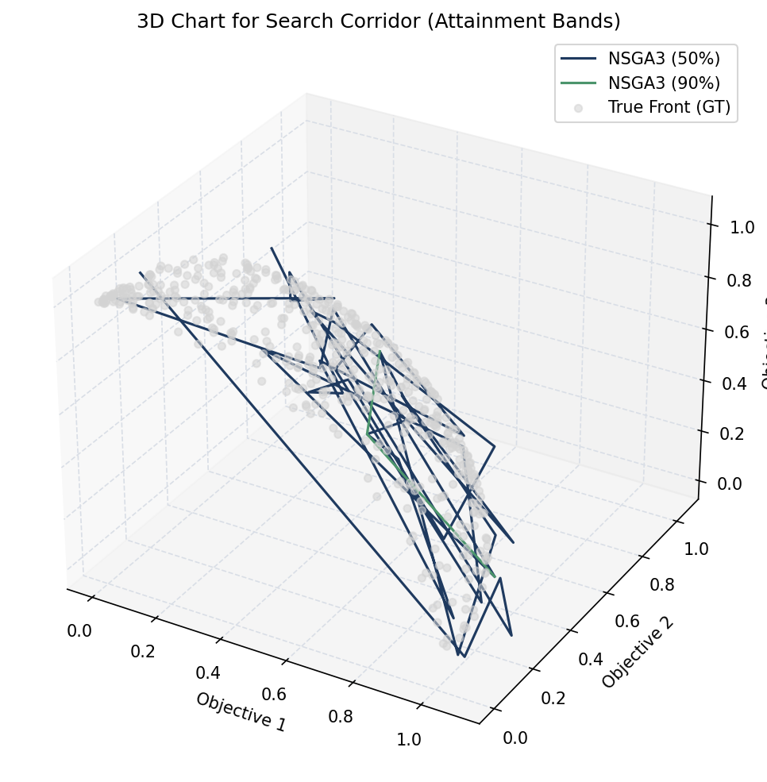
*Figure 4: Search Reliability Corridor showing 50% and 90% attainment bands.*
*Interpretation: In this plot, the narrow dark band represents the median behavior (50% probability), while the lighter band shows the 90% confidence interval. A narrow 90% band (as seen here) indicates high run-to-run consistency, meaning the algorithm is reliable.*


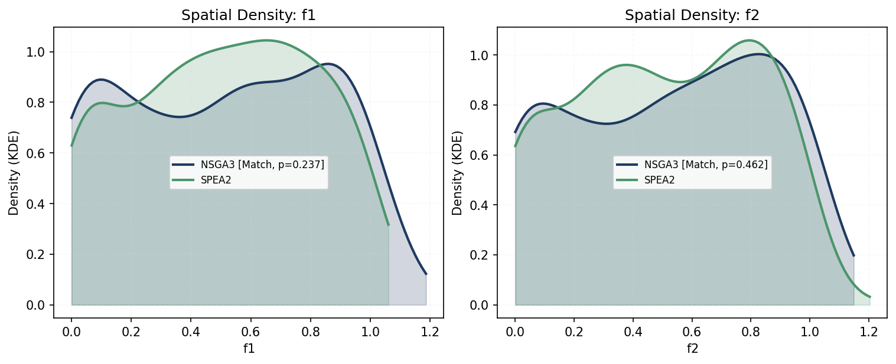
*Figure 5: Topological Equivalence Analysis (Generated by `examples/example_10.py`). LEFT: A "Match" in objective space indicates similar convergence. RIGHT: A "Mismatch" in decision space reveals distinct search strategies.*
*Interpretation: Left: The blue and orange points overlap perfectly in objective space, meaning both algorithms achieved the same performance. Right: In decision space, however, they form distinct clusters, revealing that they arrived at similar solutions using completely different variable configurations. This is a classic example of "functional redundancy" or multimodal convergence.*


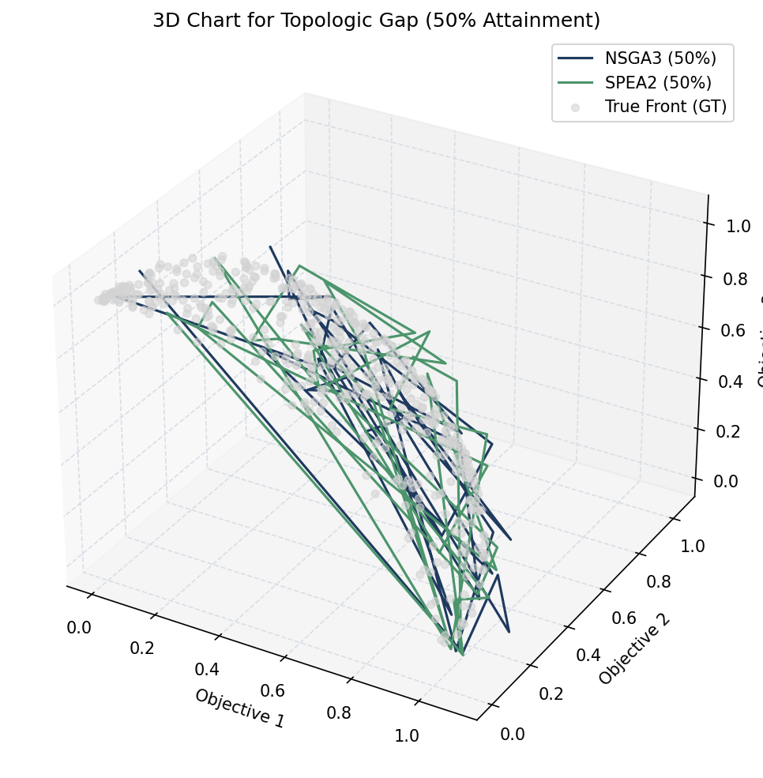
*Figure 6: Topologic Gap visualizing the spatial coverage difference between two solvers.*
*Interpretation: The highlighted red regions indicate areas of the Pareto front that Algo A found but Algo B missed completely. This reveals a "blind spot" in Algo B's search strategy despite exhibiting similar overall hypervolume values.*


### **7.2. Performance (Scalar Metrics)**
This domain reduces high-dimensional outcomes into scalar values (Hypervolume, IGD) to facilitate statistical comparison and ranking.

*   **`perf_history`**: Plots the evolution of a metric over generations, showing the mean trajectory and standard deviation cloud.
*   **`perf_spread`**: Visualizes **Performance Contrast**. It uses Boxplots to compare distributions and automatically annotates them with the **A12 Win Probability** and P-values (respecting `defaults.alpha`).
*   **`perf_density`**: Shows the "Stochastic Distribution Analysis"—the probability distribution of metric values, identifying if an algorithm is stable or outlier-prone.

#### **Metric Rigor and Interpretation**
MoeaBench prioritizes mathematical honesty. When evaluating performance against a **Ground Truth (GT)**, the following protocols apply:

*   **Tripartite Hypervolume Reporting**: Starting with v0.7.6, Hypervolume is reported using three standardized measures:
    1.  **H_raw**: The physical dominated volume.
    2.  **H_ratio**: Search area coverage (normalized to 1.1 reference).
    3.  **H_rel**: Convergence to the truth.
*   **Performance Saturation (H_rel > 100%)**: This occurs when an algorithm's population fills spatial gaps within the discrete reference sampling of the GT. It is a sign of **Convergence Saturation**—the algorithm has reached the maximum precision allowed by the reference discretization.
*   **The EMD Diagnostic**: Proximity metrics like IGD can be deceptive on degenerate fronts (e.g., DPF family). We use **Earth Mover's Distance (EMD)** as our primary indicator of **Topological Integrity**. A high EMD signal takes precedence over IGD, as it identifies clumping and loss of manifold extents that distance-based metrics might overlook.

```python
# Statistical contrast between two methods
mb.view.perf_spread(exp1, exp2, metric=mb.metrics.hypervolume)

# Metric evolution over time
mb.view.perf_history(exp)

# Probability Distribution (Luck Stability)
mb.view.perf_density(exp1, exp2)
```

> [!NOTE]
> **Legacy Support**: While `mb.view.topo_shape` and `mb.view.perf_history` are the canonical names, the aliases `mb.view.spaceplot` and `mb.view.timeplot` are supported for backward compatibility but are not recommended for new projects.

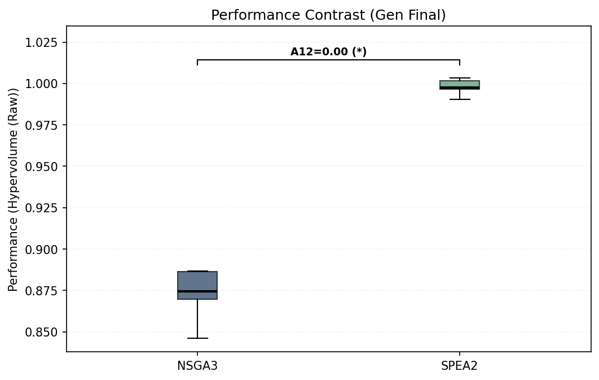
*Figure 7: Performance Contrast using Boxplots with automated A12 and Significance annotations.*
*Interpretation: The boxplot confirms that NSGA-III (Blue) significantly outperforms MOEA/D (Orange). The annotation `A12=1.00` and `p=0.00e+00` statistically proves that NSGA-III wins in 100% of the pairwise comparisons with extremely high confidence.*


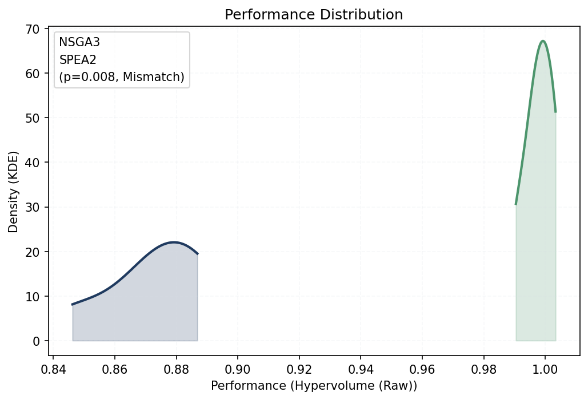
*Figure 8: Performance Distribution (KDE) identifying algorithm stability and outlier sensitivity.*
*Interpretation: The sharp peak of Algorithm B (Orange) indicates highly stable, predictable performance centered around 0.65. Algorithm A (Blue), despite having a similar mean, shows a "fat tail" distribution extending to 0.45, indicating a higher risk of occasional poor quality runs.*


#### **Programmatic Access**
You can access the raw metric data displayed in these plots using the `mb.metrics` module. Every metric calculation returns a **Rich Result** (`MetricMatrix`) that supports narrative reporting.

```python
# 1. Quick Performance Diagnosis
res = mb.metrics.hypervolume(exp)
res.report_show()
```

> [!NOTE]
> **Metric Aliases**: For convenience, `mb.metrics.hv` is provided as a permanent alias for `mb.metrics.hypervolume`.

# 2. Raw Access
raw = res.values   # (G, R) matrix
last = res.gens()  # Metrics of the last generation
```

**The output is something like:**

```text
--- Metric Report: Hypervolume (My Experiment) ---
  Final Performance (Last Gen):
    - Mean: 0.820412
    - StdDev: 0.012450
    - Best: 0.841033
  Search Dynamics:
    - Runs: 30
    - Generations: 500
    - Stability: High
```

### **7.3. Stratification (Population Structure)**
This domain examines the internal organization of the population, analyzing selection pressure and non-domination levels (Pareto ranks).

*   **`strat_ranks`**: Shows the distribution of individuals across non-domination layers (Ranks).
*   **`strat_caste`**: Maps the relationship between quality and class membership, revealing how the elite differs from the rest of the population.
*   **`strat_tiers`**: A "Duel of Proportions" that merges two algorithms into global tiers to see who dominates whom in direct competition.

```python
# Competitive Tier Analysis
mb.view.strat_tiers(exp1, exp2)
```


*Figure 9: Global Rank Distribution showing population density across non-domination layers.*
*Interpretation: This plot reveals a scenario where the population is stratified into multiple layers (5 ranks). While the majority (~50%) are in Rank 0, a significant portion lags in deeper ranks, indicating that the algorithm (MOEA/D on DTLZ1) is struggling to push the entire population to the Pareto front at this stage (Gen 14).*

#### **Visualizing the Hierarchy (`strat_caste`)**
The `strat_caste` plot maps the "Caste System" of the population, visualizing the trade-off between **Quantity** (Density) and **Quality** (Performance).

```python
# 1. Individual Merit (Micro View): Diversity distribution within ranks
mb.view.strat_caste(exp, mode='individual', title="Population Merit")

# 2. Stochastic Stability (Macro View): Robustness across multiple runs
mb.view.strat_caste(exp, mode='collective', title="Stochastic Robustness")
```

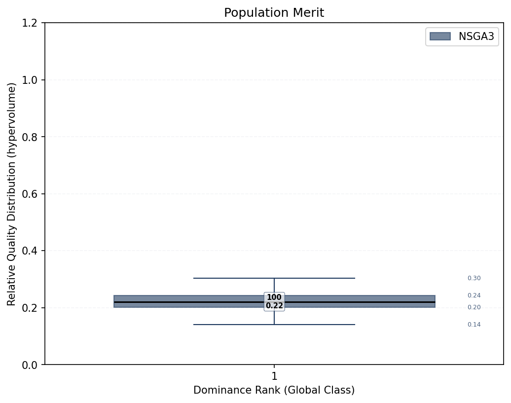
*Figure 10: Micro-view "Per Capita" (Individual Merit). This plot uses **Boxplots** to visualize the internal diversity within each social class (Rank).*
*Interpretation: The Y-axis measures the quality (Crowding Distance) of individual citizens. The numbers on the box represent the **Quartiles** (Q1, Median, Q3). Rank 1 (The Elite) is the most populous (`n=94`, or 94%) and features a tall box. This indicates a "Healthy Elite": a highly diverse population ranging from specialized outliers (top whisker) to crowded averages (median), ensuring genetic richness.*

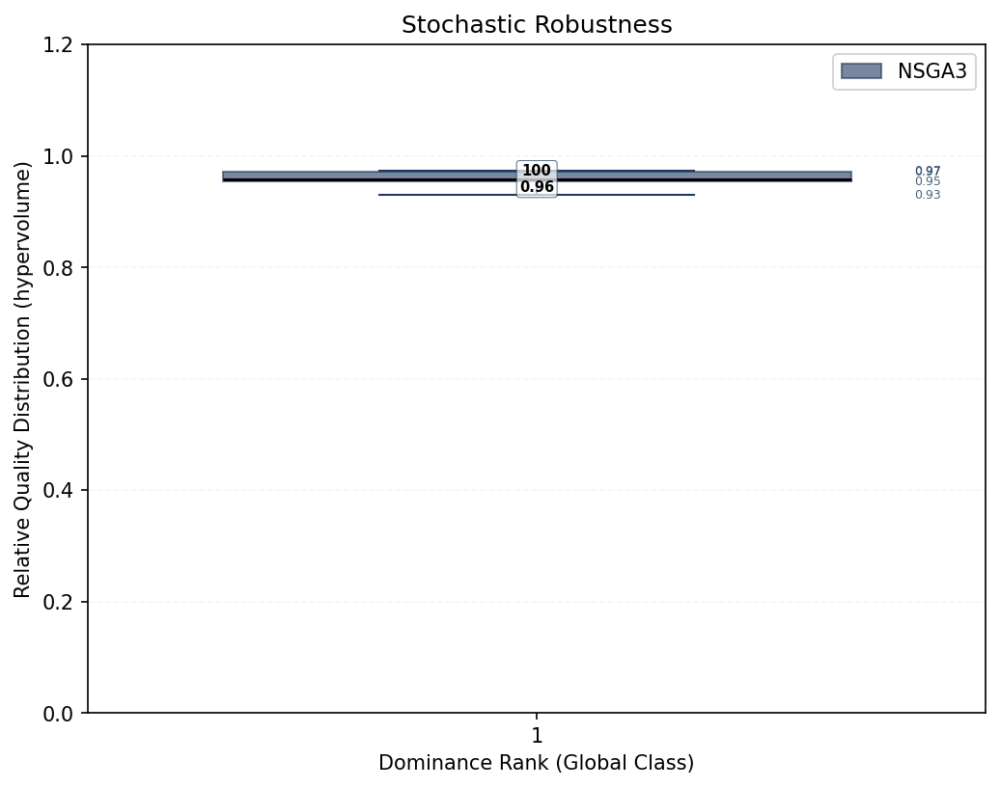
*Figure 11: Macro-view "GDP" (Gross Domain Product). Unlike the previous plot, this visualizes the **Aggregate Power** of the population across 10 independent runs.*
*Interpretation: Here, the Y-axis represents the total quality sum per run. The extreme vertical stability of the Rank 1 box (very short whiskers) visually proves that the algorithm is deterministically reliable. It consistently delivers ~94% of its "GDP" into the elite rank across all repeats, with negligible variance due to random seeds.*


---

#### **Programmatic Access**
To inspect the population structure without plotting, use the `mb.stats.strata` object.

```python
# Analyze the experiment (or a specific population)
res = mb.stats.strata(exp)

# 0. Quick Diagnosis
# Generates a narrative summary (Markdown in notebooks, print in console)
res.report_show()

# 1. Basic Properties
dist = res.frequencies()        # [0.5, 0.3, ...]: Proportion per rank
depth = res.max_rank            # Total number of layers found (e.g. 5)
press = res.selection_pressure  # Estimated selection pressure (slope)
```

The output is something like:

```text
--- Population Strata Report: Population ---
  Search Depth: 5 non-dominated layers
  Selection Pressure: 0.9612

Rank   | Pop %    | Quality (hypervolume)
----------------------------------------
1      |    50.0% |       0.7812
...
```

#### **2. Caste Inspection (Raw Data)**

To dive deeper into the metrics of a specific rank:

```python
mask = (res.rank_array == 1)      # Boolean mask for the Elite Caste (Rank 1)
elite_pop = res.objectives[mask]  # (N_elite x M) Objective values of Rank 1

# 3. Statistical Summary (Boxplot equivalents)
stats = res.caste_summary()      # Helper object for stats
n_elite = stats.n(rank=1)        # Headcount for Rank 1
q_median = stats.q(rank=1)       # Median quality for Rank 1

# 4. Competitive Analysis (Tier Duel)
# Merge two experiments to see who dominates whom
t_res = mb.stats.tier(exp1, exp2)
ratio = t_res.dominance_ratio      # [0.6, 0.4] means Exp1 holds 60% of Rank 1
```

---

## **8. Statistical Analysis (`mb.stats`)**

The `mb.stats` module transforms raw stochastic trajectories into scientific evidence. 
A core philosophy of MoeaBench is that results should be **narrative diagnostics**, not just raw numbers. Every statistical function returns a **Rich Result Object** equipped with a `.report_show()` method that handles display for you.

### **8.1. Hypothesis Testing & Significance**
These tools answer the critical question: *"Is the difference purely due to luck?"*

#### **Proving Superiority (Performance Analysis)**
To rigorously compare two algorithms (`exp1` vs `exp2`) based on a metric (e.g., Hypervolume):

```python
# 1. Test for Statistical Significance (Mann-Whitney U)
# Answers: "Is the difference real?"
res = mb.stats.perf_evidence(exp1, exp2, metric=mb.metrics.hv)

# 2. Get a narrative diagnosis
# Automatically prints or renders Markdown
res.report_show() 
```

The output is something like:

```text
--- Mann-Whitney U (Win Evidence) Test Report ---
  Comparison: exp1 vs exp2
  Alternative: two-sided
  Statistic: 1450.0000
  P-Value:   0.001204 (Significant at alpha=0.05)
  A12 Effect Size: 0.8200 (Large)

Conclusion: There is a statistically significant difference favoring exp1.
```

#### **Accessing Raw Data**

Most result objects also allow programmatic access to the underlying metrics:

```python
if res.is_significant:
    # Measure Effect Size (Vargha-Delaney A12)
    # Answers: "How often does it win?"
    prob = mb.stats.perf_probability(exp1, exp2, metric=mb.metrics.hv)
```

#### **Testing Topological Consistency**
To verify if two algorithms found the same regions of the objective space (e.g., comparing a baseline against an optimized version):

```python
# Check if spatial distributions match (Kolmogorov-Smirnov test per axis)
topo_res = mb.stats.topo_distribution(exp_baseline, exp_optimized)

# Hybrid Output: renders Markdown in notebooks, prints in terminal
topo_res.report_show()
```

> [!NOTE]
> **Further Reading**: MoeaBench supports a wide array of statistical tests, including Anderson-Darling, Earth Mover's Distance (EMD), and Kolmogorov-Smirnov for distribution shapes. For a complete list of available tests and their mathematical definitions, consult the **[API Reference](reference.md#stats)**.

---

## **9. Algorithmic Diagnostics and Pathology Detection**
    
Modern optimization algorithms can fail in subtle ways that raw numbers often hide. For example, an algorithm might achieve a near-perfect Generational Distance (GD) score by finding a single optimal point, while completely failing to cover the rest of the Pareto Front. This phenomenon, known as **Diversity Collapse**, can easily mislead researchers who only look at a single metric table.

MoeaBench introduces a dedicated **Algorithmic Diagnostics** module (`mb.diagnostics`) designed to act as an automated expert system. This module moves beyond simple metrics (`float`) to clinical quality scores (`q_score`), interpreting *how* good a result is compared to the physical limits of the problem resolution.

> [!TIP]
> **Further Reading**: Curious about why we renamed "Fitness" to "Headway" or how we handle "Worse-than-Random" results? Read the full engineering decision record: **[ADR 0028](../docs/adr/0028-refined-clinical-diagnostics-v0.9.1.md)**.

### **9.1. Diagnostic Ontology**

MoeaBench transforms raw performance data into a "detailed diagnostic assessment". This system is designed for deep algorithmic diagnostics, helping you understand not just *how much* an algorithm failed, but *why* it failed. The diagnostic system targets six primary dimensions of algorithmic health:

| Dimension | Physical Meaning (Unit: $s_k$) | Pathology Target |
| :--- | :--- | :--- |
| **Closeness** | Normalized distance to the true manifold. | Stagnation / Poor convergence. |
| **Coverage** | Connectivity from the target to the solution. | Holes / Uncovered regions. |
| **Gap** | Size of the largest detected manifold hole. | Local trapping / Discontinuity. |
| **Regularity** | Spacing uniformity between neighbors. | Clumping / Unstructured density. |
| **Balance** | Distribution bias across Pareto regions. | Dimensional bias / Focus loss. |
| **Headway** | Depth of convergence (95th percentile). | Poor initialization / Weak drive. |

### **9.2. Physical Metrics (FAIR Principles)**

These metrics quantify the physical properties of the population (distance, uniformity) in a way that is **Normalized by Resolution**. We divide distances by $s_K$ (the expected distance between points in a perfect front at size $K$). This makes the metrics comparable across different problem scales. These metrics provide raw, resolution-invariant physical facts about the population.

#### **`headway`**
- **Rationale**: Deviation of the Population **from** the Ground Truth ($P \to GT$). Traditionally, convergence metrics like Generational Distance (GD) measure raw distance to the front. `headway` refines this by filtering out the worst 5% outliers (Headway) and normalizing the result by the expected resolution of the problem ($s_K$). This provides a "Fair" score that represents convergence depth in units of the manifold's own density.
- **Example**:
```python
d = mb.diagnostics.headway(exp)
```

#### **`closeness`**
- **Rationale**: While `headway` provides a scalar summary, `closeness` returns the raw distribution of distances for every point in the population. This allows researchers to visualize the "scatter" of the front or perform detailed statistical analysis on individual solution proximity.
- **Example**:
```python
u_vals = mb.diagnostics.closeness(exp)
```

#### **`coverage`**
- **Rationale**: Deviation of the Ground Truth **from** the Population ($GT \to P$). Standard IGD is sensitive to the number of points. `coverage` uses the average distance from the Ground Truth to the population to measure how well the solver has "reached" the entire manifold. It answers: "On average, how far is any optimal point from being found?"
- **Example**:
```python
cov = mb.diagnostics.coverage(exp)
```

#### **`gap`**
- **Rationale**: An algorithm might have good average coverage but still leave massive "holes" on the front. `gap` calculates the 95th percentile of the IGD components to quantify the size of the largest coverage failures (the Gaps), ensuring that narrow-but-deep search failures are identified.
- **Example**:
```python
gap = mb.diagnostics.gap(exp)
```

#### **`regularity`**
- **Rationale**: Measures spatial uniformity. It uses the Wasserstein-1 (EMD) distance to compare the population's nearest-neighbor distribution against a perfectly uniform lattice. This detects if the algorithm is "clumping" or if it has successfully distributed solutions evenly across the front.
- **Example**:
```python
reg = mb.diagnostics.regularity(exp)
```

#### **`balance`**
- **Rationale**: High-dimensional manifolds often feature distinct "regions" or clusters. `balance` uses Jensen-Shannon Divergence to check if the algorithm has explored all clusters of the Ground Truth with the same probability as the reference density, detecting manifold occupancy bias.
- **Example**:
```python
bal = mb.diagnostics.balance(exp)
```

---

### **9.3. Clinical Normalization (Q-Scores)**

A Quality-Score (Q-Score) is not a raw physical measurement. It is a **clinical normalization** of the physical facts. It is an **interpolated rank** situated between an **Analytical Ideal** ($Q=1.0$) and a **Standardized Noise Floor** ($Q=0.0$). This ensures that a score of $0.8$ represents the same degree of "algorithmic health" regardless of whether the problem objectives are in the range $[0, 1]$ or $[0, 10^6]$.

#### **Diagnostic Tiers**
The scale is divided into five diagnostic tiers:
- **$[0.95, 1.00]$ - Asymptotic (Blue)**: Optimal performance, indistinguishable from the analytical truth.
- **$[0.85, 0.95]$ - State-of-the-Art (Dark Green)**: High-precision research-grade results.
- **$[0.67, 0.85]$ - Competent / Industrial (Green)**: Robust and reliable for engineering applications.
- **$[0.34, 0.67]$ - Marginal / Exploratory (Yellow)**: Detectable drive, but unstable or coarse results.
- **$[0.00, 0.34]$ - Failure / Random (Red)**: Performance indistinguishable from unguided search.

#### **`q_headway` (Log-Linear Scale)**
- **Rationale**: Map the physical `headway` result onto a $[0, 1]$ utility scale. It uses a **Log-Linear** mapping to provide high resolution near the optimal front ($Q=1.0$), distinguishing between "Converged" and "Super-Converged" results.
- **Example**:
```python
score = mb.diagnostics.q_headway(exp)
```
- **Interpretation Example ($Q=0.8$)**: The algorithm has traveled 80% of the log-distance between a random start and the Pareto front. Because the scale is logarithmic, this indicates that the solver has overcome the "initial resistance" and is effectively converging.

#### **`q_closeness` (ECDF Scale)**
- **Rationale**: Calibrates point-wise closeness using a **Monotonicity Gate**. It compares the population distribution against a **Blind Sampling Baseline** ($Rand_{50}$), ensuring that scores only approach $1.0$ if the solutions are structurally closer to the front than random noise.
- **Example**:
```python
score = mb.diagnostics.q_closeness(exp)
```
- **Interpretation Example ($Q=0.8$)**: The population's proximity to the front is better than 80% of the random baseline samples. It is a **Sufficient** result for high-stakes engineering.

#### **`q_coverage` (ECDF Scale)**
- **Rationale**: Uses a full **ECDF (Empirical Cumulative Distribution Function)** of random sampling to rank the coverage. A score of $0.5$ means the algorithm is exactly as good as a random target of the front, while $Q > 0.9$ indicates scientific-grade manifold reach.
- **Example**:
```python
score = mb.diagnostics.q_coverage(exp)
```
- **Interpretation Example ($Q=0.8$)**: Signifies **Standard Coverage**. The algorithm has successfully mapped the primary features of the manifold, indicating scientific-grade reach.

#### **`q_gap` (ECDF Scale)**
- **Rationale**: Ranks the continuity of the front. It identifies if the solver has "broken" the manifold into fragments. Like coverage, it is ranked via ECDF against baseline hole distributions.
- **Example**:
```python
score = mb.diagnostics.q_gap(exp)
```
- **Interpretation Example ($Q=0.8$)**: Signifies **Managed Gaps**. The solver has successfully maintained the continuity of the manifold, and any remaining fragments are within acceptable scientific limits.

#### **`q_regularity` (Rank Scale)**
- **Rationale**: Clinical assessment of internal population structure. It quantifies the "Regularity" progress, allowing users to detect if a solver's diversity-maintenance mechanism is working as expected or failing relative to random behavior.
- **Example**:
```python
score = mb.diagnostics.q_regularity(exp)
```
- **Interpretation Example ($Q=0.8$)**: Indicates an **Ordered/Consistent** distribution. Solutions are not clumping significantly, and the diversity-maintenance mechanism is working effectively.

#### **`q_balance` (Rank Scale)**
- **Rationale**: The final clinical check for manifold bias. It answers: "Is the distribution of solutions across clusters better than a random draw?" Significant balanced search results in $Q \to 1.0$.
- **Example**:
```python
score = mb.diagnostics.q_balance(exp)
```
- **Interpretation Example ($Q=0.8$)**: Indicates an **Equitable/Fair** distribution across clusters. Manifold occupancy bias is low, and the algorithm is exploring different Pareto regions with similar probability.

---

### **9.4. Diagnostic Instruments**

MoeaBench provides four primary visualization tools (instruments) to inspect any performance dimension across Layer 1 (Physical) or Layer 2 (Clinical). These instruments are polymorphic and agnostic to the underlying metric.

#### **Instrument 1: The Radar (`clinic_radar`)**
*   **Role**: *Holistic Validation*.
*   **Description**: A spider plot that visualizes the 6 Quality Scores (Q-Scores) simultaneously: Closeness, Coverage, Gap, Regularity, Balance, and Headway.
*   **Interpretation**: A larger, more symmetric polygon indicates a healthy, "well-rounded" algorithm. Sharp collapses in one axis (e.g., GAP) highlight specific algorithmic pathologies.
*   **Example**:
```python
# Holistic validation
mb.view.clinic_radar(exp)
```

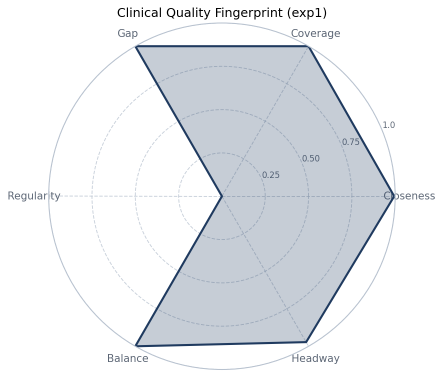
*Figure 3: Holistic Audit: The Radar instrument identifies functional imbalances.*

**Didactic Guide**:
When looking at the Radar, observe the "shape" of the search. A symmetric $Q \approx 0.8$ polygon represents a versatile solver. If you see a "spike" pointing inward at **GAP**, your algorithm has converged to the front but has failed to find representative "bridges" between clusters. If **HEADWAY** is high but **CLOSENESS** is low, your algorithm is moving but has not yet reached the "asymptotic" zone of precision.

#### **Instrument 2: The ECDF (`clinic_ecdf`)**
*   **Role**: *Goal Attainment Assessment*.
*   **Description**: Plots the Empirical Cumulative Distribution Function of a metric.
*   **Markers**: Automatically shows **Median (50%)** and **Robust Max (95%)** drop-lines.
*   **Interpretation**: Useful for assessing consistency. A steep curve shifted to the left indicates that most of the population reached a high-quality state. A "long tail" indicates outliers or unstructured search.
*   **Example**:
```python
# Deep dive into 'Coverage' pathology
mb.view.clinic_ecdf(exp, metric="coverage")
```

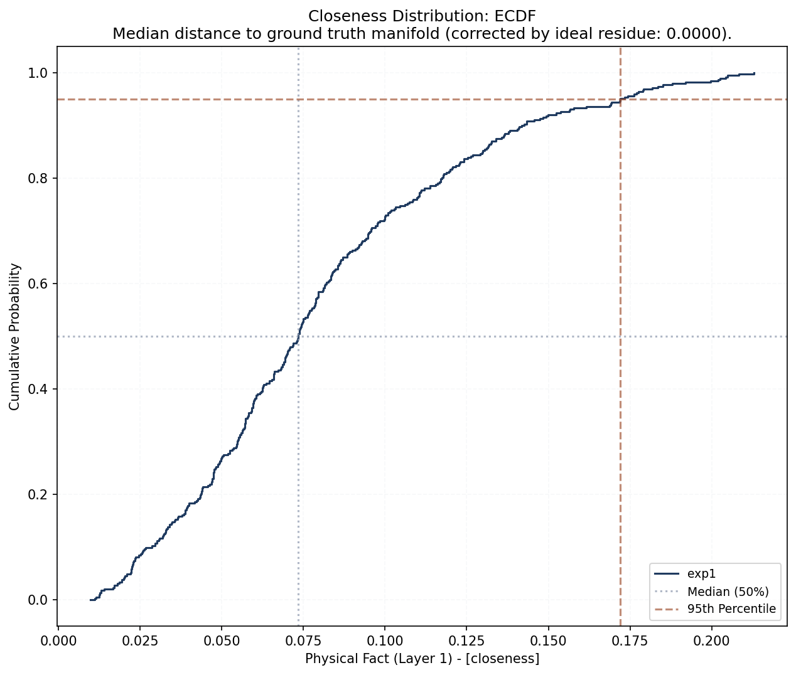
*Figure 4: Statistical Consensus: The ECDF instrument monitors goal attainment.*

**Didactic Guide**:
The X-axis represents the physical error (Layer 1), and the Y-axis represents the probability. A vertical "cliff" means all solutions reached the same level. A "long tail" on the right signifies that some solutions are still lost in the decision space. The **95% marker** is your "Worst Case" guarantee; if it is beyond the **Rand50** baseline, your algorithm's results are statistically indistinguishable from a random guess.

#### **Instrument 3: The Distribution (`clinic_distribution`)**
*   **Role**: *Error Morphology Analysis*.
*   **Description**: A density/histogram plot of point-wise performance.
*   **Interpretation**: Helps identify the "shape" of the search error. A bimodal distribution might suggest that the algorithm is succeeding in some regions but completely failing in others.
*   **Example**:
```python
# Deep dive into 'Coverage' pathology
mb.view.clinic_distribution(exp, metric="coverage")
```

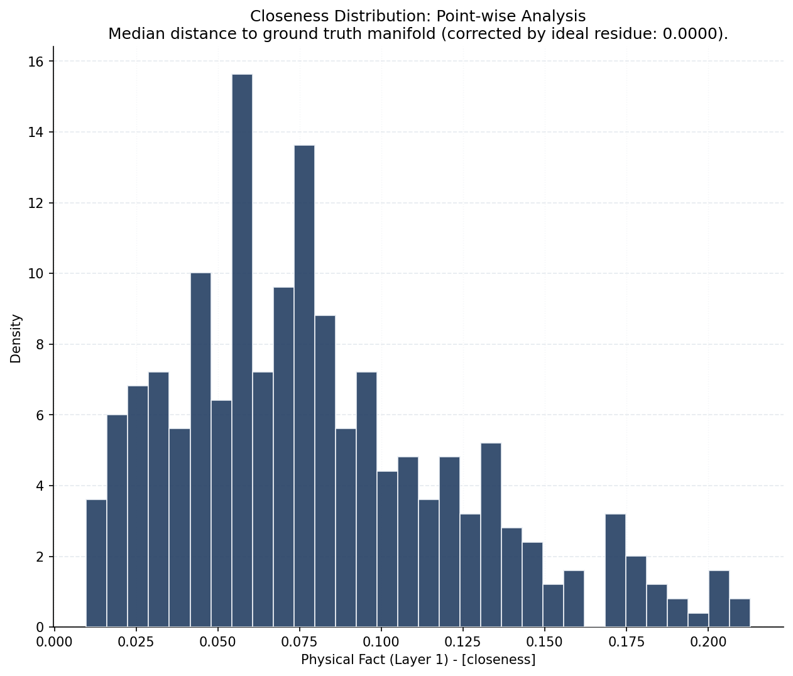
*Figure 5: Population Morphology: Identifying multimodality in search errors.*

**Didactic Guide**:
Search errors are rarely normal (Gaussian). Look for **Multi-modality**. If you see two distinct peaks, your algorithm has "split" its focus: it found a local optimum for some objectives while being trapped for others. A wide, flat distribution suggests that the populations' proximity to the front is chaotic and unorganized.

#### **Instrument 4: The History (`clinic_history`)**
*   **Role**: *Temporal Evolution Analysis*.
*   **Description**: Tracks the evolution of a physical fact over generations across all runs.
*   **Interpretation**: Differentiates between slow-but-steady convergence and premature stalling.
*   **Example**:
```python
# Monitor 'Balance' over time to check for drift
mb.view.clinic_history(exp, metric="balance")
```

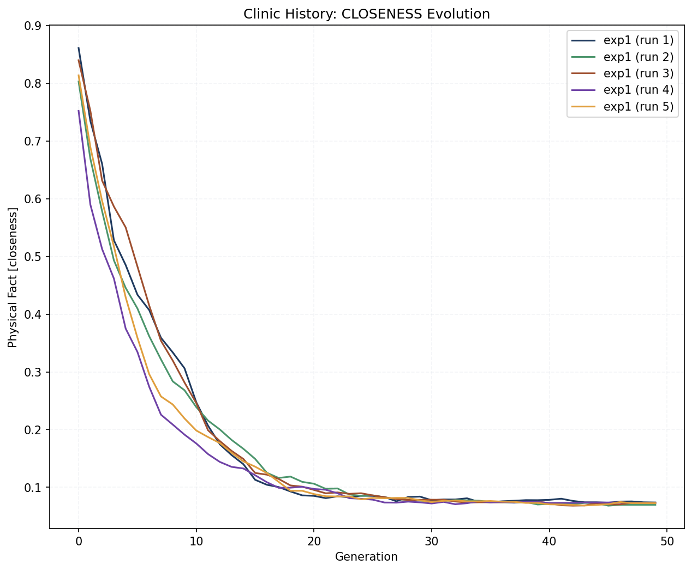
*Figure 6: Temporal Trajectory: Tracking the "velocity" of optimization.*

**Didactic Guide**:
Watch the slope of the curve. A horizontal line that appears early in the experiment indicates a **Stall**. If the variance between runs (the shaded area) increases over time, your algorithm is sensitive to initial conditions (low robustness). Ideally, the variance should decrease as the population "funnels" toward the Pareto front.

---

### **9.5. Reporting Interface and Auditing Workflow**

The `mb.diagnostics` API handles all the complexity of Ground Truth resolution and metric interpretation for you. Beyond raw numbers, all results support a **Universal Reporting Contract**.

#### **Scenario A: Full Audit**
The `audit()` function performs a comprehensive check and returns a `DiagnosticResult` with a rich reporting interface:

```python
import MoeaBench as mb

exp = mb.experiment(moea="NSGA3", mop="DTLZ2")
exp.run()

# 1. Perform a scientific audit
res = mb.diagnostics.audit(exp)

# 2. Display interactive report (Rich Markdown in Notebooks)
res.report_show()

# 3. Access narrative summary as a string (if needed)
# text = res.report()
# print(res.verdicts) # {'Q_HEADWAY': 'Effective', ...}
```

#### **Scenario B: Individual Metric deep-dive**
Even individual metrics like `q_headway` or `coverage` support the reporting contract:

```python
# Returns an object that acts as a float
q = mb.diagnostics.q_headway(exp)

# Use it as a number in calculations
print(f"Current Q_HEADWAY: {float(q):.4f}")

# Explain the clinical significance mapping
q.report_show()
```

#### **Scenario C: Manual/Raw Data**
If you have a raw NumPy array (from an external library):

```python
import numpy as np

# Your raw data (PopSize x Objectives)
my_front = np.random.rand(100, 3) 

# You MUST provide the Ground Truth and Resolution Scale (s_K)
true_pf = ... # Your analytical front
s_k = 0.05    # Your estimated resolution scale

# Calculate Physical Metric and report physical meaning
fact = mb.diagnostics.closeness(my_front, ref=true_pf, s_k=s_k)
fact.report_show()
```


### **9.6. The Validation Hierarchy**

A common question is: *"Why are some algorithms (like NSGA-II) marked as 'Certified' while others (like SPEA2) are not? Can I still use SPEA2?"*

The answer is: **Yes, absolutely.** Functionally, there is zero difference.

*   **Runtime Equality**: The `mb.diagnostics` module works identically for *any* algorithm. You can generate Q-Scores, Clinical Radars, and perform full audits on SPEA2, MOEA/D, or your own custom plugin. They all use the same mathematical Ground Truth ($GT$) and Baselines found in `baselines.json`.
*   **The Difference (Static vs. Dynamic)**: The term "Certified" simply means that the algorithm is included in the library's official, static **Calibration Report** (`tests/CALIBRATION.html`). This is a frozen PDF/HTML document generated at release time to prove the library's correctness.
*   **Baseline Origin**: The "Baselines" (Random vs. Ideal) used to calculate Q-Scores are derived analytically from the problem's Ground Truth found in `calibration_package.npz`. They are **not** created by running NSGA-II. Thus, the scoring system is unbiased and fair to all solvers.

#### **Longitudinal Auditing: Comparing against History**

Scientific progress is longitudinal. MoeaBench provides two mechanisms to audit current results against historical or alternative reference systems.

#### **Mechanism A: Contextual Baseline Switching**
To verify if a new algorithm version is better relative to an *older* baseline (e.g., from v0.8.0), use the `use_baselines` context manager:

```python
# Directly from mb.diagnostics
with mb.diagnostics.use_baselines("references/baselines_v0.8.json"):
    res = mb.diagnostics.audit(exp)
    res.report_show()
```
# System automatically reverts to the current library baselines here

#### **Mechanism B: Polymorphic Path Loading**
You can audit against a specific Ground Truth file (saved from a previous publication) simply by passing the path:

```python
# MoeaBench automatically detects .npy, .npz, and .csv formats
mb.diagnostics.audit(exp, ground_truth="data/published_gt.npz")
```

---

## **10. Extensibility: Plugging your Algorithm**

Extensibility is the core reason for MoeaBench's existence. You use the framework to evaluate **your** code.

### **Custom MOP Plugin**
To add a new problem, inherit from `mb.mops.BaseMop` and implement the `evaluation` method. 

> [!TIP]
> **See it in action**: A complete demonstration of a custom MOP is available in **`examples/example_05.py`**. For detailed technical requirements of the `evaluation` contract, see [Reference Guide: Section 9.1](reference.md#extensibility).

```python
class MyProblem(mb.mops.BaseMop):
    def __init__(self):
        super().__init__(M=2, N=10) # 2 objectives, 10 variables
        self.xl = np.zeros(10)      # Decision variable lower bounds
        self.xu = np.ones(10)       # Decision variable upper bounds

    def evaluation(self, X):
        # Must return a dictionary with the objectives matrix 'F'
        # Optional: include constraints matrix 'G'
        f1 = ...
        f2 = ...
        return {'F': np.column_stack([f1, f2])}
```

### **Custom MOEA Plugin**
To wrap your own algorithm, inherit from `mb.moeas.BaseMoea`. By implementing the `evaluation()` interface, your algorithm gains access to all of MoeaBench's infrastructure (automated runs, seeds, and persistence).

### **10.1. MOP Plugin Support and Calibration**

MoeaBench v0.9+ introduces a decentralized calibration system for custom MOPs. This allows you to add new problems with full clinical diagnostic support (Radar plots, Q-Scores) without modifying the library's core.

#### **The "One-Click" Calibration Workflow**
For a custom MOP to be clinically certified, it needs a **Sidecar JSON** file containing its Ground Truth (GT) and statistical baselines (ECDF). You can generate this automatically:

```python
# 1. Instantiate your custom MOP
mop = MyProblem()

# 2. Perform "One-Click" Calibration
# This samples the Pareto set (ps), calculates baselines, and saves a Sidecar
mop.calibrate()

# 3. Everything is now ready for deep diagnostics
exp = mb.experiment(mop=mop)
exp.run()
mb.view.clinic_radar(exp) # Works perfectly with custom baselines!
```

#### **How it Works: The Sidecar Pattern**
- **Persistence**: `mop.calibrate()` creates a JSON file (e.g., `MyProblem.json`) next to your Python class.
- **Portability**: You can share this JSON file along with your code. MoeaBench will automatically find and load it if it's in the same directory as the problem definition.
- **Scientific Integrity**: The sidecar stores a "frozen" Ground Truth, ensuring that your Q-Scores remain comparable even if you change your sampling logic later.

> [!IMPORTANT]
> **Pareto Set Requirement**: To use `calibrate()`, your custom MOP **must** implement the `ps(n)` method, which provides the analytical Pareto Set (decision variables) sample. This is the source of "truth" for all subsequent calibrations.

```python
class MyProblem(mb.mops.BaseMop):
    # ... __init__ and evaluation ...
    
    def ps(self, n):
        # Return a matrix of n decision variables belonging to the Pareto Set
        t = np.linspace(0, 1, n)
        return np.column_stack([t, np.zeros((n, self.N-1))])
```

---

## **11. Persistence (`save` and `load`)**

MoeaBench allows you to persist experiments to disk as compressed ZIP files. 

```python
# 1. Save the complete state (Config + All Runs)
exp.save("full_study", mode="all")

# 2. Save only the 'Recipe' (No data)
exp.save("protocol", mode="config")

# 3. Load results into an existing setup
exp.load("results", mode="data")
```

#### **Persistence Modes**

*   **`all` (Default)**: Persists the entire state (Problem + Algorithm + Runs).
*   **`config`**: Records only the "experimental protocol" (MOP/MOEA settings).
*   **`data`**: Focuses on the results of the execution (Runs).

#### **Enhanced Scientific Metadata (v2)**
Starting with v0.10.1, the `save()` command generates a **Schema v2** archive. This ZIP file is self-documenting and contains:
- **`metadata.json`**: Machine-readable provenance (MoeaBench version, Python environment, and a SHA256 hash of the `baselines_v4.json` data package used).
- **`README.md`**: Human-readable summary including **SPDX headers** (if authors and license are set in `exp`), configuration details, and execution timestamps.

---

## **12. Data Export (CSV)**

MoeaBench provides a dedicated **Export API** in the `mb.system` module for raw numerical results.

```python
# 1. Export results from a named experiment
exp.name = "my_study"
mb.system.export_objectives(exp) # Saves to "my_study_objectives.csv"

# 2. Export data from a specific population snapshot
pop = exp.last_pop
mb.system.export_objectives(pop, "final_pop_objs.csv")
```

---

## **13. References**

*   **[API Reference](reference.md)**: Total technical mapping of the library.
*   **[Pymoo](https://pymoo.org)**: The optimization engine powering built-in algorithms.
*   **[MOPs Manual](mops.md)**: Detailed history and mathematics of built-in benchmarks.

---

## **16. Architectural Decisions and Engineering Values**

MoeaBench is built on a set of core engineering values designed to balance scientific rigor with user experience. These decisions, documented formally in `docs/design.md` and `docs/adr/`, ensure that the framework serves as an instrument of insight rather than just a calculation engine.

*   **Scientific Narrative (Technical Storytelling)**: The architecture prioritizes narrative clarity in data representation. The library avoids 'black boxes' by implementing a **Universal Reporting Contract**. Every analytical object (`Experiment`, `MetricMatrix`, `StatsResult`) inherits a standard `.report_show()` interface, augmenting raw numbers with descriptive insights to help researchers bridge the gap between calculation and interpretation.

*   **Performance & Scalability**: To support massive many-objective experiments, the framework enforces a **"Loop-Free" Vectorized Engine**. By leveraging NumPy broadcasting for all critical paths (benchmarks, metrics, and dominance checks), MoeaBench scales efficiently without the performance penalty of native Python iterations.

*   **Rigor & Calibration**: Reliability is certified through regular **Calibration Reports** that audit metric precision. Robustness is baked into the algorithms; for instance, the **MOEA/D** solver employs a **Hybrid Decomposition Strategy (ADR 003)** that automatically switches between PBI and Tchebycheff methods to prevent population collapse on degenerate manifolds.

*   **Reproducibility**: We enforce **Determinism by Design** through strict seed management, ensuring every run can be reconstructed exactly. Additionally, our **Mirror Parity** policy ensures that every production script in `examples/` has a corresponding interactive Notebook (`.ipynb`), making research both deployable and explorable.

*   **Usability & Aesthetics**: Visualization is a first-class citizen. Features like **Visual Micro-Jitter (ADR 004)** illustrate our commitment to clarity—by applying minute gaussian noise to plots, we ensure that overlapping algorithms remain visually distinguishable ("Comparative Isomorphism") without compromising the numerical exactness of the underlying statistical tests.
